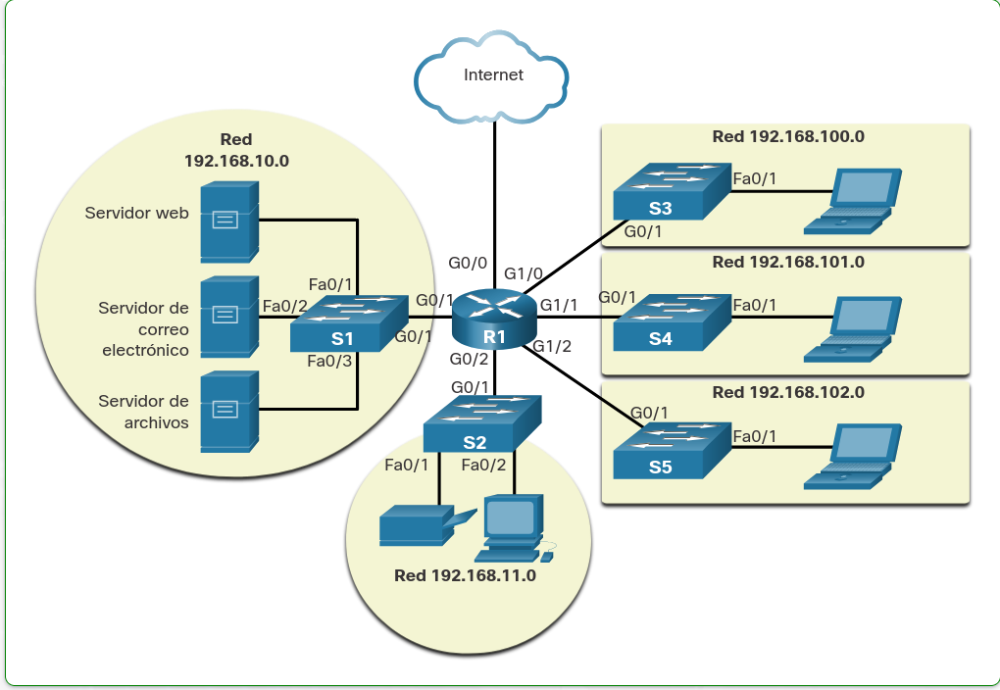

# Modulo # 1 : Redes en la Actualidad.

# [*] Tema 1.2.1 : Roles del Host

**Introduccion** : 

Si desea formar parte de una comunidad en línea global, su computadora, tableta o teléfono inteligente primero deben estar conectados a una red. Esa red debe estar conectada a Internet. En este tema se describen las partes de una red. ¡Vea si reconoce estos componentes en su propia red de hogar o escuela!

Todas las computadoras que están conectadas a una red y participan directamente en la comunicación de la red se clasifican como hosts. Los hosts se pueden llamar dispositivos finales. Algunos hosts también se llaman clientes. Sin embargo, el término hosts se refiere específicamente a los dispositivos de la red a los que se asigna un número para fines de comunicación. Este número identifica el host dentro de una red determinada. Este número se denomina dirección de protocolo de Internet (IP). Una dirección IP identifica el host y la red a la que está conectado el host.

Los servidores son computadoras con software que les permite proporcionar información, como correo electrónico o páginas web, a otros dispositivos finales de la red. Cada servicio requiere un software de servidor independiente. Por ejemplo, para proporcionar servicios web a la red, un servidor requiere un software de servidor web. Una computadora con software de servidor puede proporcionar servicios simultáneamente a muchos clientes diferentes.

Como se mencionó anteriormente, los clientes son un tipo de host. Los clientes disponen de software para solicitar y mostrar la información obtenida del servidor, como se muestra en la figura.

**Tipos de Host**:

    
    
# [*] Tema 1.2.2 : Entre Pares

**Introduccion** : 

El software de cliente y servidor generalmente se ejecuta en computadoras separadas, pero también es posible usar una computadora para ambos roles al mismo tiempo. En pequeñas empresas y hogares, muchas PC funcionan como servidores y clientes en la red. Este tipo de red se denomina red entre pares.

**Ventajas de las redes en pares**:

**Desventajas de las redes en pares**:

# [*] Tema 1.2.3 : Dispositivos Finales

**Introduccion**:

Los dispositivos de red con los que las personas están más familiarizadas se denominan dispositivos finales. Para distinguir un dispositivo final de otro, cada dispositivo final de una red tiene una dirección. Cuando un dispositivo final inicia la comunicación, utiliza la dirección del dispositivo final de destino para especificar dónde entregar el mensaje.

Un terminal es el origen o el destino de un mensaje transmitido a través de la red.

**ISP: Provedores de Servicio de Internet**:

    1 - Cable Wireless
    2 - Gol Data
    3 - Ufinet
    4 - Trans Ocean
    5 - Cable Onda
    
# [*] Tema 1.2.4 : Dispositivos Intermediarios

**Introduccion**:

Los dispositivos intermedios conectan los dispositivos finales individuales a la red. Pueden conectar múltiples redes individuales para formar una red interna. Los dispositivos intermedios proporcionan conectividad y garantizan el flujo de datos en toda la red.

Los dispositivos intermedios usan la dirección del dispositivo final de destino, junto con información sobre las interconexiones de la red, para determinar la ruta que los mensajes deben tomar a través de la red. En la figura, se muestran algunos ejemplos de los dispositivos intermediarios más comunes y una lista de funciones.

**Ejemplos de Dispositivos Intermediarios**:

**Funciones de los Dispositivos Intermediarios**:

    
**NOTA**: No se muestra un concentrador Ethernet. Un hub de Ethernet también se conoce como repetidor multipuerto. Los repetidores regeneran y retransmiten las señales de comunicación. Observe que todos los dispositivos intermedios realizan la función de repetidor.

# [*] Tema 1.2.5 : Medios de Red

**Introduccion**:

La comunicación se transmite a través de una red en los medios. El medio proporciona el canal por el cual viaja el mensaje desde el origen hasta el destino.

**Tipos de Medios para interconectar dispositivos**:

    1. Hilos metálicos dentro de cables - Los datos se codifican en impulsos eléctricos. EJ: Cobre.
    2. Fibras de vidrio o plástico (cable de fibra óptica) - Los datos se codifican como pulsos de luz. EJ: Fibra Optica.
    3. Transmisión inalámbrica - Los datos se codifican a través de la modulación de frecuencias específicas de ondas electromagnéticas. EJ: Tecnologia Inalambrica.

          
**Los cuatro criterios principales para elegir medios de red son**:

    1- ¿Cuál es la distancia máxima en la que el medio puede transportar una señal exitosamente?
    2 - ¿Cuál es el entorno en el que se instalarán los medios?
    3 - ¿Cuál es la cantidad de datos y a qué velocidad deben transmitirse?
    4 - ¿Cuál es el costo del medio y de la instalación?

# [*] Tema 1.3.1 : Representaciones de Red

**Introduccion**:

Los arquitectos y administradores de redes deben poder mostrar el aspecto que tendrán sus redes. Necesitan poder ver fácilmente qué componentes se conectan a otros componentes, dónde se ubicarán y cómo se conectarán. Los diagramas de redes a menudo usan símbolos, como los que se muestran en la figura, para representar los diferentes dispositivos y conexiones que forman una red.

**Dispositivos Finales**:

    1 - Computadora de Escritorio
    2 - Computadora Portatil
    3 - Impresora
    4 - Telefono IP
    5 - Tableta Inalambrica
    6 - Punto Final de Telepresence
    
**Dispositivos Intermediarios**:

    1 - Router Inalambrico
    2 - Switch LAN
    3 - Router
    4 - Switch Multicapa
    5 - Dispositivos de Firewall

**Medios de Red**:

    1 - Medios Inalambricos
    2 - Medios LAN
    3 - Medios WAN

**Diagramas de Topologia**:

Un diagrama proporciona una manera fácil de comprender cómo se conectan los dispositivos en una red grande. Este tipo de representación de una red se denomina diagrama de topología. La capacidad de reconocer las representaciones lógicas de los componentes físicos de red es fundamental para poder visualizar la organización y el funcionamiento de una red.

**Terminologia**:

    1 - Tarjeta de interfaz de red (Network Interface Card) (NIC): Una NIC conecta físicamente el dispositivo final a la red.
    2 - Puerto físico: Un conector o conexión en un dispositivo de red donde se conectan los medios a un terminal u otro          dispositivo de red.
    3 - Interfaz: Puertos especializados en un dispositivo de red que se conecta a redes individuales. Debido a que los routers conectan redes, los puertos en un router se denominan interfaces de red.

 
**NOTA**: Los términos puerto e interfaz con frecuencia se utilizan en forma indistinta.

# [*] Tema 1.3.2 : Diagramas de Topologia

**Introduccion**:

Los diagramas de topología son documentación obligatoria para cualquier persona que trabaje con una red. Estos diagramas proporcionan un mapa visual que muestra cómo está conectada la red. Hay dos tipos de diagramas de topología, físicos y lógicos.

**Diagrama de Topologia Fisica**

Los diagramas de topología física ilustran la ubicación física de los dispositivos intermedios y la instalación del cable, como se muestra en la figura. Puede ver que las habitaciones en las que se encuentran estos dispositivos están etiquetadas en esta topología física.

**Diagrama de Topologia Logica**

Los diagramas de topología lógica ilustran los dispositivos, los puertos y el esquema de direccionamiento de la red, como se muestra en la figura. Puede ver qué dispositivos finales están conectados a qué dispositivos intermediarios y qué medios se están utilizando.

# [*] Tema 1.4.1 : Redes de Muchos Tamanos

**Introduccion**:

Ahora que está familiarizado con los componentes que componen las redes y sus representaciones en topologías físicas y lógicas, está listo para aprender acerca de los diferentes tipos de redes.

Hay redes de todo tamaño. Pueden ir desde redes simples, compuestas por dos PC, hasta redes que conectan millones de dispositivos.

Las redes domésticas sencillas le permiten compartir recursos, como impresoras, documentos, imágenes y música, entre unos pocos dispositivos finales locales.

Las redes de oficinas pequeñas y oficinas domésticas (SOHO) permiten a las personas trabajar desde casa o desde una oficina remota. Muchos trabajadores independientes utilizan este tipo de redes para anunciar y vender productos, pedir suministros y comunicarse con los clientes.

Las empresas y las grandes organizaciones usan redes para proporcionar consolidación, almacenamiento y acceso a la información en los servidores de red. Las redes proporcionan correo electrónico, mensajería instantánea y colaboración entre empleados. Muchas organizaciones usan la conexión de su red a Internet para proporcionar productos y servicios a los clientes.

Internet es la red más extensa que existe. De hecho, el término Internet significa “red de redes”. Es una colección de redes privadas y públicas interconectadas.

En pequeñas empresas y hogares, muchas PC funcionan como servidores y clientes en la red. Este tipo de red se denomina red entre pares.

**Redes Domesticas Pequenas**:

Las redes domésticas pequeñas conectan algunas computadoras entre sí y a Internet.

**Redes Domesticas/de oficinas pequenas**:

La red SOHO permite que las computadoras en una oficina hogareña o remota se conecten a una red corporativa o accedan a recursos compartidos centralizados

**Redes Medianas a grandes**:

Las redes medianas a grandes, como las que se utilizan en corporaciones y escuelas, pueden tener muchas ubicaciones con cientos o miles de hosts interconectados.

**Redes Mundiales**:

Internet es una red de redes que conecta cientos de millones de computadoras en todo el mundo.

# [*] Tema 1.4.2 : LAN y WAN

**Introduccion**:

Las infraestructuras de red pueden variar en gran medida en términos de:

    1 - El tamaño del área que abarcan.
    2 - La cantidad de usuarios conectados.
    3 - La cantidad y los tipos de servicios disponibles.
    4 - El área de responsabilidad

Los dos tipos más comunes de infraestructuras de red son las redes de área local (LAN) y las redes de área amplia (WAN). Una LAN es una infraestructura de red que proporciona acceso a usuarios y dispositivos finales en un área geográfica pequeña. Normalmente, una LAN se utiliza en un departamento dentro de una empresa, un hogar o una red de pequeñas empresas. Una WAN es una infraestructura de red que proporciona acceso a otras redes en un área geográfica amplia, que generalmente es propiedad y está administrada por una corporación más grande o un proveedor de servicios de telecomunicaciones. La figura muestra las LAN conectadas a una WAN.

**Red LAN y Red WAN**:

| Red LAN   |   Red WAN     |
| ------------- | ------------- |
| Las LANs interconectan terminales en un área limitada, como una casa, un lugar de estudios, un edificio de oficinas o un campus | Las WAN interconectan LAN a través de áreas geográficas extensas, por ejemplo, entre ciudades, estados, provincias, países o continentes. |
| Por lo general, la administración de las LAN está a cargo de una única organización o persona. El control administrativo se aplica a nivel de red y rige las políticas de seguridad y control de acceso.|Por lo general, la administración de las WAN está a cargo de varios proveedores de servicios.Las LANs proporcionan ancho de banda de alta velocidad a dispositivos finales internos y dispositivos intermedios, como se muestra en la figura.| Normalmente, las WAN proporcionan enlaces de velocidad más lenta entre redes LAN.
|Las LANs proporcionan ancho de banda de alta velocidad a dispositivos finales internos y dispositivos intermedios, como se muestra en la figura.|Normalmente, las WAN proporcionan enlaces de velocidad más lenta entre redes LAN.

# [*] Tema 1.4.3 : El Internet

Internet es una colección global de redes interconectadas (internetworks o internet para abreviar). En la figura se muestra una forma de ver a la Internet como una colección de LAN y WAN interconectadas.

Algunos de los ejemplos de LAN están conectados entre sí a través de una conexión WAN. Las WAN están conectadas entre sí. Las líneas de conexión WAN rojas representan todas las variedades de formas en las que conectamos las redes. WANs can connect through copper wires, fiber-optic cables, and wireless transmissions (not shown).

Internet no pertenece a una persona o un grupo. Garantizar una comunicación efectiva en esta infraestructura heterogénea requiere la aplicación de estándares y tecnologías uniformes, y comúnmente reconocidas, así como también la cooperación de muchas agencias de administración de redes. Hay organizaciones que se desarrollaron para ayudar a mantener la estructura y la estandarización de los protocolos y procesos de Internet. Entre estas organizaciones, se encuentran el Grupo de trabajo de ingeniería de Internet (IETF), la Corporación de Internet para la Asignación de Nombres y Números (ICANN) y el Consejo de Arquitectura de Internet (IAB), entre muchas otras.

# [*] Tema 1.4.4 : Intranets y Extranets

El término intranet se utiliza para referirse a la conexión privada de LAN y WAN que pertenecen a una organización. Una intranet está diseñada para que solo puedan acceder a ella los miembros y empleados de la organización, u otras personas autorizadas.

Es posible que una organización utilice una extranet para proporcionar acceso seguro a las personas que trabajan para otra organización, pero requieren datos de la empresa. Aquí hay algunos ejemplos de extranets:

**Ejemplos de Extranets**:

    1 - Una empresa que proporciona acceso a proveedores y contratistas externos.
    2 - Un hospital que proporciona un sistema de reservas a los médicos para que puedan hacer citas para sus pacientes.
    3 - Una secretaría de educación local que proporciona información sobre presupuesto y personal a las escuelas del distrito.

La figura ilustra los niveles de acceso que los diferentes grupos tienen a una intranet de la empresa, a una extranet de la empresa y a Internet.

# [*] Tema 1.5.1 : Tecnologias de Acceso a Internet

Los usuarios domésticos, los trabajadores remotos y las oficinas pequeñas generalmente requieren una conexión a un ISP para acceder a Internet. Las opciones de conexión varían mucho entre los ISP y las ubicaciones geográficas. Sin embargo, las opciones más utilizadas incluyen banda ancha por cable, banda ancha por línea de suscriptor digital (DSL), redes WAN inalámbricas y servicios móviles.

Las organizaciones generalmente necesitan acceso a otros sitios corporativos, así como a Internet. Para admitir servicios empresariales, como telefonía IP, videoconferencias y el almacenamiento en centros de datos, se requieren conexiones rápidas. Los SPs ofrecen interconexiones de clase empresarial. Los servicios de nivel empresarial más comunes son DSL empresarial, líneas arrendadas y red Metro Ethernet.
