# Modulo # 1 : Redes en la Actualidad.

# [*] Tema 1.2.1 : Roles del Host

**Introduccion** : 

Si desea formar parte de una comunidad en línea global, su computadora, tableta o teléfono inteligente primero deben estar conectados a una red. Esa red debe estar conectada a Internet. En este tema se describen las partes de una red. ¡Vea si reconoce estos componentes en su propia red de hogar o escuela!

Todas las computadoras que están conectadas a una red y participan directamente en la comunicación de la red se clasifican como hosts. Los hosts se pueden llamar dispositivos finales. Algunos hosts también se llaman clientes. Sin embargo, el término hosts se refiere específicamente a los dispositivos de la red a los que se asigna un número para fines de comunicación. Este número identifica el host dentro de una red determinada. Este número se denomina dirección de protocolo de Internet (IP). Una dirección IP identifica el host y la red a la que está conectado el host.

Los servidores son computadoras con software que les permite proporcionar información, como correo electrónico o páginas web, a otros dispositivos finales de la red. Cada servicio requiere un software de servidor independiente. Por ejemplo, para proporcionar servicios web a la red, un servidor requiere un software de servidor web. Una computadora con software de servidor puede proporcionar servicios simultáneamente a muchos clientes diferentes.

Como se mencionó anteriormente, los clientes son un tipo de host. Los clientes disponen de software para solicitar y mostrar la información obtenida del servidor, como se muestra en la figura.

---

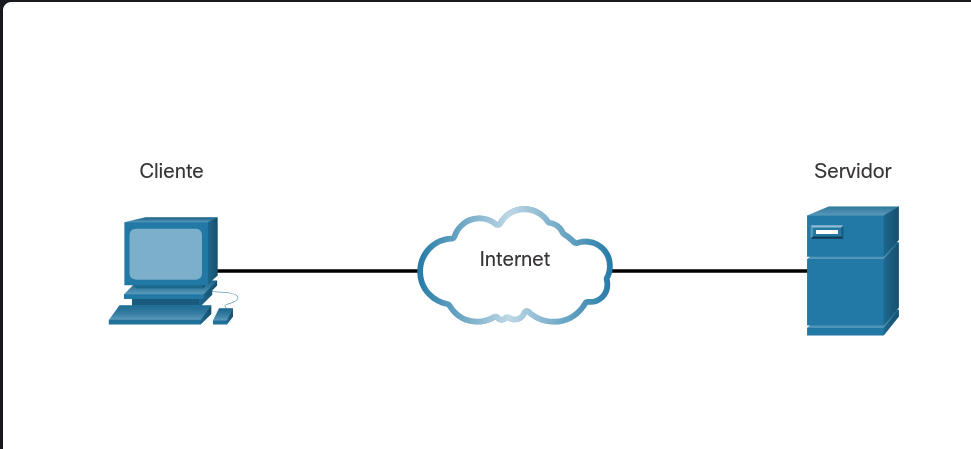

---

**Tipos de Host**:

---

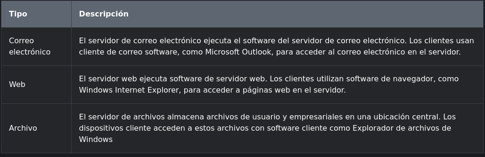

---
    
    
# [*] Tema 1.2.2 : Entre Pares

**Introduccion** : 

El software de cliente y servidor generalmente se ejecuta en computadoras separadas, pero también es posible usar una computadora para ambos roles al mismo tiempo. En pequeñas empresas y hogares, muchas PC funcionan como servidores y clientes en la red. Este tipo de red se denomina red entre pares.

---

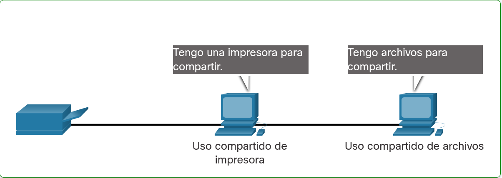

---

**Ventajas de las redes en pares**:

---

---

**Desventajas de las redes en pares**:

---

---

# [*] Tema 1.2.3 : Dispositivos Finales

**Introduccion**:

Los dispositivos de red con los que las personas están más familiarizadas se denominan dispositivos finales. Para distinguir un dispositivo final de otro, cada dispositivo final de una red tiene una dirección. Cuando un dispositivo final inicia la comunicación, utiliza la dirección del dispositivo final de destino para especificar dónde entregar el mensaje.

Un terminal es el origen o el destino de un mensaje transmitido a través de la red.

---

**ISP: Provedores de Servicio de Internet**:

---

    1 - Cable Wireless
    2 - Gol Data
    3 - Ufinet
    4 - Trans Ocean
    5 - Cable Onda

---
    
# [*] Tema 1.2.4 : Dispositivos Intermediarios

**Introduccion**:

Los dispositivos intermedios conectan los dispositivos finales individuales a la red. Pueden conectar múltiples redes individuales para formar una red interna. Los dispositivos intermedios proporcionan conectividad y garantizan el flujo de datos en toda la red.

Los dispositivos intermedios usan la dirección del dispositivo final de destino, junto con información sobre las interconexiones de la red, para determinar la ruta que los mensajes deben tomar a través de la red. En la figura, se muestran algunos ejemplos de los dispositivos intermediarios más comunes y una lista de funciones.

---

**Ejemplos de Dispositivos Intermediarios**:

---

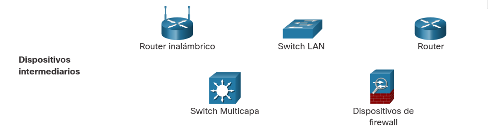

---

**Funciones de los Dispositivos Intermediarios**:

---

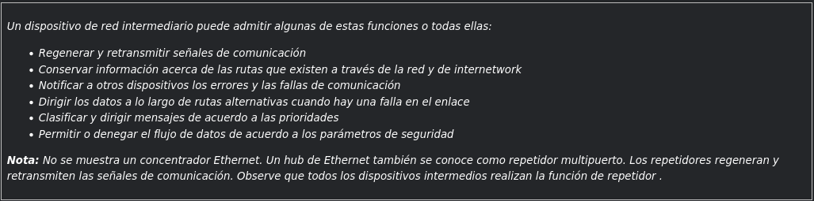
    
---

**NOTA**: No se muestra un concentrador Ethernet. Un hub de Ethernet también se conoce como repetidor multipuerto. Los repetidores regeneran y retransmiten las señales de comunicación. Observe que todos los dispositivos intermedios realizan la función de repetidor.

---

# [*] Tema 1.2.5 : Medios de Red

**Introduccion**:

La comunicación se transmite a través de una red en los medios. El medio proporciona el canal por el cual viaja el mensaje desde el origen hasta el destino.

---

**Tipos de Medios para interconectar dispositivos**:

---

    1. Hilos metálicos dentro de cables - Los datos se codifican en impulsos eléctricos. EJ: Cobre.
    2. Fibras de vidrio o plástico (cable de fibra óptica) - Los datos se codifican como pulsos de luz. EJ: Fibra Optica.
    3. Transmisión inalámbrica - Los datos se codifican a través de la modulación de frecuencias específicas de ondas electromagnéticas. EJ: Tecnologia Inalambrica.

---

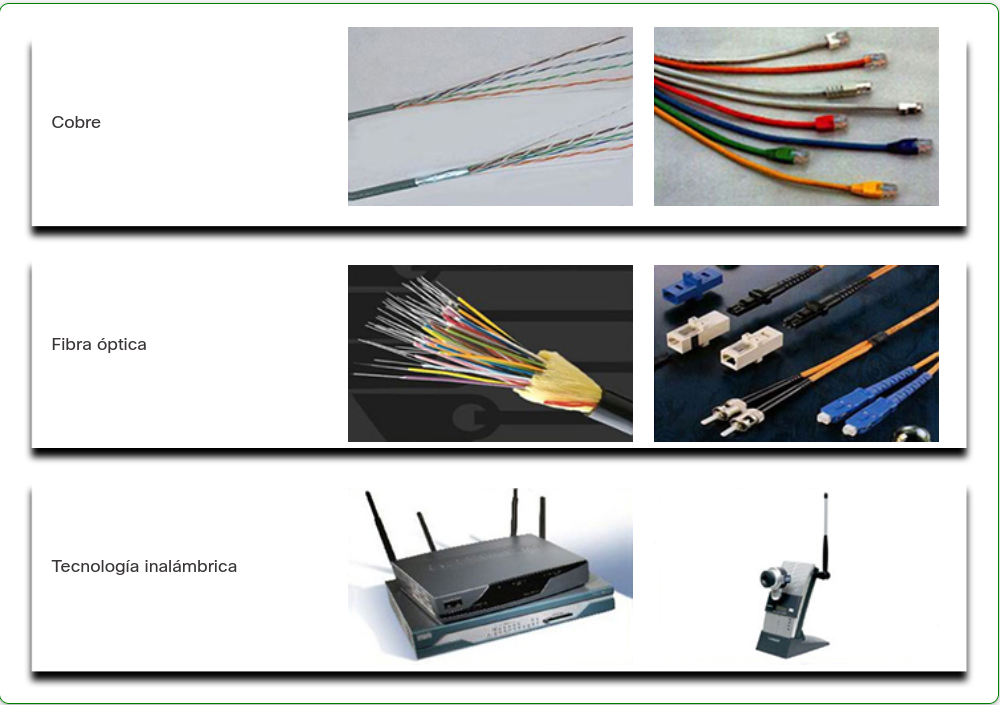

---
          
**Los cuatro criterios principales para elegir medios de red son**:

---

    1- ¿Cuál es la distancia máxima en la que el medio puede transportar una señal exitosamente?
    2 - ¿Cuál es el entorno en el que se instalarán los medios?
    3 - ¿Cuál es la cantidad de datos y a qué velocidad deben transmitirse?
    4 - ¿Cuál es el costo del medio y de la instalación?

---

# [*] Tema 1.3.1 : Representaciones de Red

**Introduccion**:

Los arquitectos y administradores de redes deben poder mostrar el aspecto que tendrán sus redes. Necesitan poder ver fácilmente qué componentes se conectan a otros componentes, dónde se ubicarán y cómo se conectarán. Los diagramas de redes a menudo usan símbolos, como los que se muestran en la figura, para representar los diferentes dispositivos y conexiones que forman una red.

---

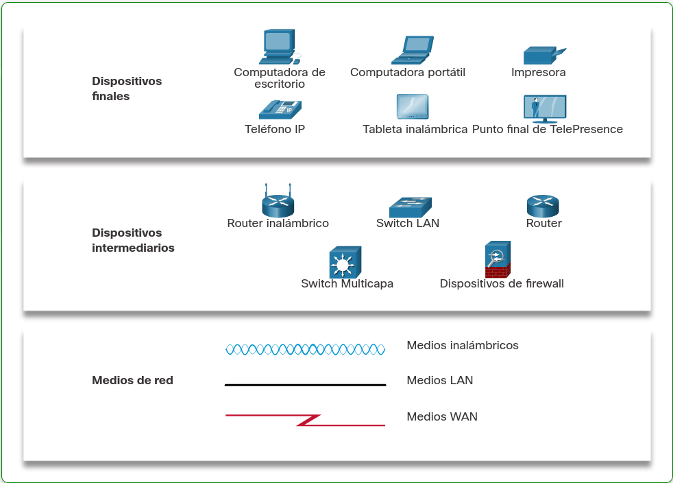

---

**Dispositivos Finales**:

---

    1 - Computadora de Escritorio
    2 - Computadora Portatil
    3 - Impresora
    4 - Telefono IP
    5 - Tableta Inalambrica
    6 - Punto Final de Telepresence

---
    
**Dispositivos Intermediarios**:

---

    1 - Router Inalambrico
    2 - Switch LAN
    3 - Router
    4 - Switch Multicapa
    5 - Dispositivos de Firewall

---

**Medios de Red**:

---

    1 - Medios Inalambricos
    2 - Medios LAN
    3 - Medios WAN

---

**Diagramas de Topologia**:

---

Un diagrama proporciona una manera fácil de comprender cómo se conectan los dispositivos en una red grande. Este tipo de representación de una red se denomina diagrama de topología. La capacidad de reconocer las representaciones lógicas de los componentes físicos de red es fundamental para poder visualizar la organización y el funcionamiento de una red.

---

**Terminologia**:

---

    1 - Tarjeta de interfaz de red (Network Interface Card) (NIC): Una NIC conecta físicamente el dispositivo final a la red.
    2 - Puerto físico: Un conector o conexión en un dispositivo de red donde se conectan los medios a un terminal u otro          dispositivo de red.
    3 - Interfaz: Puertos especializados en un dispositivo de red que se conecta a redes individuales. Debido a que los routers conectan redes, los puertos en un router se denominan interfaces de red.

---
 
**NOTA**: Los términos puerto e interfaz con frecuencia se utilizan en forma indistinta.

---

# [*] Tema 1.3.2 : Diagramas de Topologia

**Introduccion**:

Los diagramas de topología son documentación obligatoria para cualquier persona que trabaje con una red. Estos diagramas proporcionan un mapa visual que muestra cómo está conectada la red. Hay dos tipos de diagramas de topología, físicos y lógicos.

---

**Diagrama de Topologia Fisica**

---

Los diagramas de topología física ilustran la ubicación física de los dispositivos intermedios y la instalación del cable, como se muestra en la figura. Puede ver que las habitaciones en las que se encuentran estos dispositivos están etiquetadas en esta topología física.

---

---

**Diagrama de Topologia Logica**

---

Los diagramas de topología lógica ilustran los dispositivos, los puertos y el esquema de direccionamiento de la red, como se muestra en la figura. Puede ver qué dispositivos finales están conectados a qué dispositivos intermediarios y qué medios se están utilizando.

---

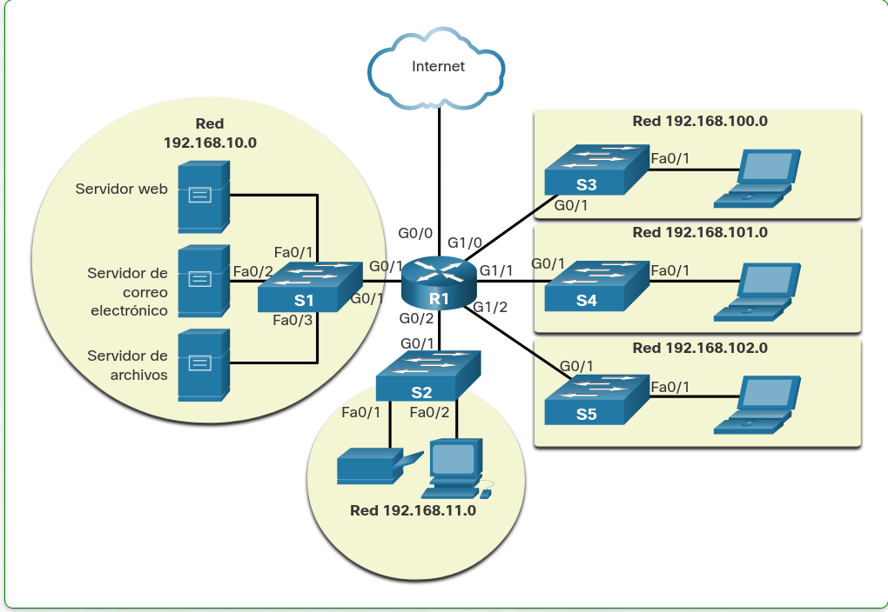

---

# [*] Tema 1.4.1 : Redes de Muchos Tamanos

**Introduccion**:

Ahora que está familiarizado con los componentes que componen las redes y sus representaciones en topologías físicas y lógicas, está listo para aprender acerca de los diferentes tipos de redes.

Hay redes de todo tamaño. Pueden ir desde redes simples, compuestas por dos PC, hasta redes que conectan millones de dispositivos.

Las redes domésticas sencillas le permiten compartir recursos, como impresoras, documentos, imágenes y música, entre unos pocos dispositivos finales locales.

Las redes de oficinas pequeñas y oficinas domésticas (SOHO) permiten a las personas trabajar desde casa o desde una oficina remota. Muchos trabajadores independientes utilizan este tipo de redes para anunciar y vender productos, pedir suministros y comunicarse con los clientes.

Las empresas y las grandes organizaciones usan redes para proporcionar consolidación, almacenamiento y acceso a la información en los servidores de red. Las redes proporcionan correo electrónico, mensajería instantánea y colaboración entre empleados. Muchas organizaciones usan la conexión de su red a Internet para proporcionar productos y servicios a los clientes.

Internet es la red más extensa que existe. De hecho, el término Internet significa “red de redes”. Es una colección de redes privadas y públicas interconectadas.

En pequeñas empresas y hogares, muchas PC funcionan como servidores y clientes en la red. Este tipo de red se denomina red entre pares.

---

**Redes Domesticas Pequenas**:

---

Las redes domésticas pequeñas conectan algunas computadoras entre sí y a Internet.

---

**Redes Domesticas/de oficinas pequenas**:

---

La red SOHO permite que las computadoras en una oficina hogareña o remota se conecten a una red corporativa o accedan a recursos compartidos centralizados

---

**Redes Medianas a grandes**:

---

Las redes medianas a grandes, como las que se utilizan en corporaciones y escuelas, pueden tener muchas ubicaciones con cientos o miles de hosts interconectados.

---

**Redes Mundiales**:

---

Internet es una red de redes que conecta cientos de millones de computadoras en todo el mundo.

---

# [*] Tema 1.4.2 : LAN y WAN

**Introduccion**:

Las infraestructuras de red pueden variar en gran medida en términos de:

    1 - El tamaño del área que abarcan.
    2 - La cantidad de usuarios conectados.
    3 - La cantidad y los tipos de servicios disponibles.
    4 - El área de responsabilidad

Los dos tipos más comunes de infraestructuras de red son las redes de área local (LAN) y las redes de área amplia (WAN). Una LAN es una infraestructura de red que proporciona acceso a usuarios y dispositivos finales en un área geográfica pequeña. Normalmente, una LAN se utiliza en un departamento dentro de una empresa, un hogar o una red de pequeñas empresas. Una WAN es una infraestructura de red que proporciona acceso a otras redes en un área geográfica amplia, que generalmente es propiedad y está administrada por una corporación más grande o un proveedor de servicios de telecomunicaciones. La figura muestra las LAN conectadas a una WAN.

---

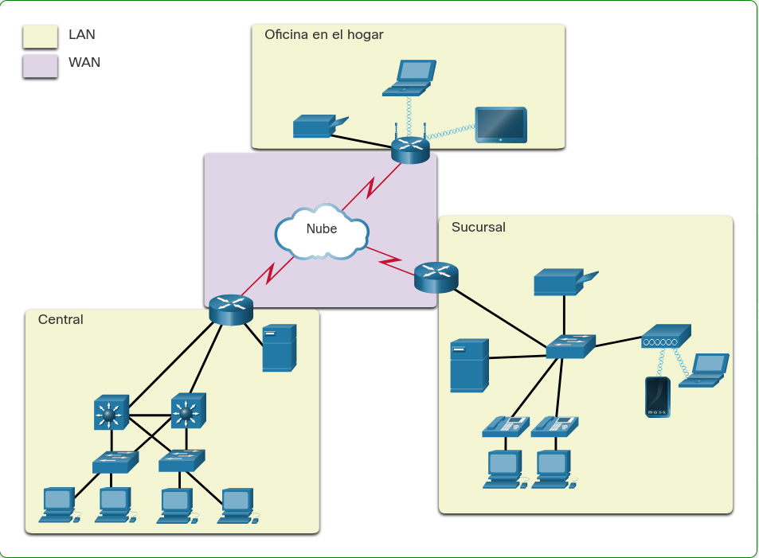

---

**Red LAN y Red WAN**:

---
| Red LAN   |   Red WAN     |
| ------------- | ------------- |
| Las LANs interconectan terminales en un área limitada, como una casa, un lugar de estudios, un edificio de oficinas o un campus | Las WAN interconectan LAN a través de áreas geográficas extensas, por ejemplo, entre ciudades, estados, provincias, países o continentes. |
| Por lo general, la administración de las LAN está a cargo de una única organización o persona. El control administrativo se aplica a nivel de red y rige las políticas de seguridad y control de acceso.|Por lo general, la administración de las WAN está a cargo de varios proveedores de servicios.Las LANs proporcionan ancho de banda de alta velocidad a dispositivos finales internos y dispositivos intermedios, como se muestra en la figura.| Normalmente, las WAN proporcionan enlaces de velocidad más lenta entre redes LAN.
|Las LANs proporcionan ancho de banda de alta velocidad a dispositivos finales internos y dispositivos intermedios, como se muestra en la figura.|Normalmente, las WAN proporcionan enlaces de velocidad más lenta entre redes LAN.
---

# [*] Tema 1.4.3 : El Internet

**Introduccion**:

Internet es una colección global de redes interconectadas (internetworks o internet para abreviar). En la figura se muestra una forma de ver a la Internet como una colección de LAN y WAN interconectadas.

---

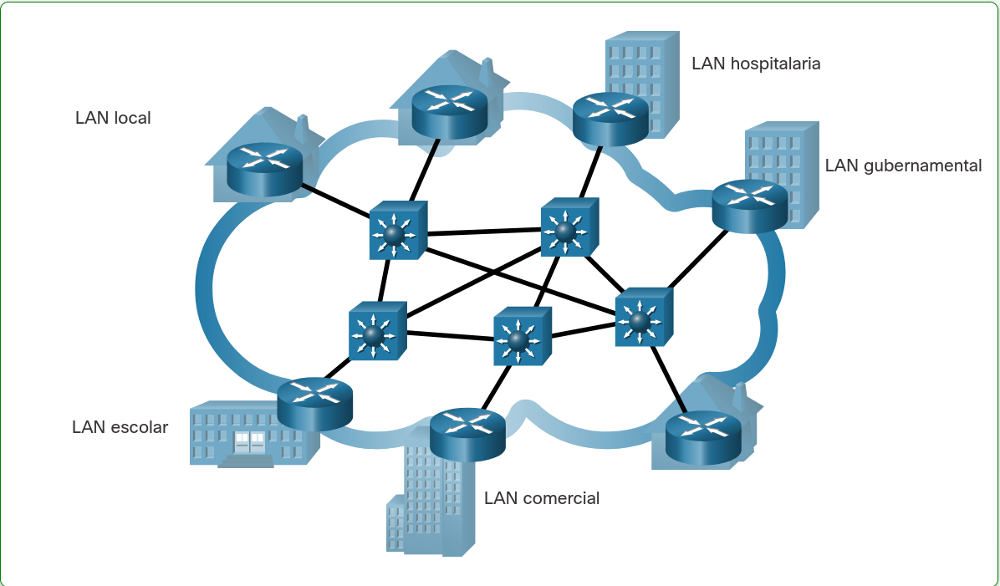

---

Algunos de los ejemplos de LAN están conectados entre sí a través de una conexión WAN. Las WAN están conectadas entre sí. Las líneas de conexión WAN rojas representan todas las variedades de formas en las que conectamos las redes. WANs can connect through copper wires, fiber-optic cables, and wireless transmissions (not shown).

Internet no pertenece a una persona o un grupo. Garantizar una comunicación efectiva en esta infraestructura heterogénea requiere la aplicación de estándares y tecnologías uniformes, y comúnmente reconocidas, así como también la cooperación de muchas agencias de administración de redes. Hay organizaciones que se desarrollaron para ayudar a mantener la estructura y la estandarización de los protocolos y procesos de Internet. Entre estas organizaciones, se encuentran el Grupo de trabajo de ingeniería de Internet (IETF), la Corporación de Internet para la Asignación de Nombres y Números (ICANN) y el Consejo de Arquitectura de Internet (IAB), entre muchas otras.

---

# [*] Tema 1.4.4 : Intranets y Extranets

**Introduccion**:

El término intranet se utiliza para referirse a la conexión privada de LAN y WAN que pertenecen a una organización. Una intranet está diseñada para que solo puedan acceder a ella los miembros y empleados de la organización, u otras personas autorizadas.

Es posible que una organización utilice una extranet para proporcionar acceso seguro a las personas que trabajan para otra organización, pero requieren datos de la empresa. Aquí hay algunos ejemplos de extranets:

---

**Ejemplos de Extranets**:

    1 - Una empresa que proporciona acceso a proveedores y contratistas externos.
    2 - Un hospital que proporciona un sistema de reservas a los médicos para que puedan hacer citas para sus pacientes.
    3 - Una secretaría de educación local que proporciona información sobre presupuesto y personal a las escuelas del distrito.

La figura ilustra los niveles de acceso que los diferentes grupos tienen a una intranet de la empresa, a una extranet de la empresa y a Internet.

---

---

# [*] Tema 1.5.1 : Tecnologias de Acceso a Internet

**Introduccion**:

Los usuarios domésticos, los trabajadores remotos y las oficinas pequeñas generalmente requieren una conexión a un ISP para acceder a Internet. Las opciones de conexión varían mucho entre los ISP y las ubicaciones geográficas. Sin embargo, las opciones más utilizadas incluyen banda ancha por cable, banda ancha por línea de suscriptor digital (DSL), redes WAN inalámbricas y servicios móviles.

Las organizaciones generalmente necesitan acceso a otros sitios corporativos, así como a Internet. Para admitir servicios empresariales, como telefonía IP, videoconferencias y el almacenamiento en centros de datos, se requieren conexiones rápidas. Los SPs ofrecen interconexiones de clase empresarial. Los servicios de nivel empresarial más comunes son DSL empresarial, líneas arrendadas y red Metro Ethernet.

---

# [*] Tema 1.5.2 : Conexiones a Internet domesticas y de Oficinas

**Introduccion**:

En la figura, se muestran opciones de conexión comunes para los usuarios de oficinas pequeñas y oficinas en el hogar, que incluyen las siguientes:

---

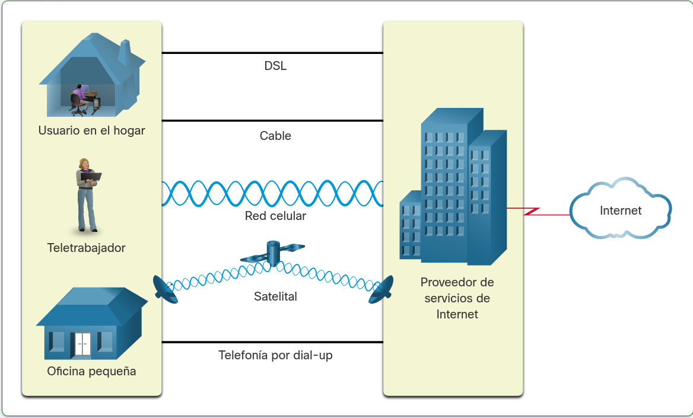

---
| Concepto     | Explicacion    |
| ------------- | ------------- |
| Cable         |  Típicamente ofrecido por los proveedores de servicios de televisión por cable, la señal de datos de Internet se transmite en el mismo cable que ofrece la televisión por cable. Proporciona un gran ancho de banda, alta disponibilidad y una conexión a Internet siempre activa.             |
| DSL           | Las líneas de suscriptor digital también proporcionan un gran ancho de banda, alta disponibilidad y una conexión permanente a Internet. DSL se transporta por la línea de teléfono. En general los usuarios de oficinas en el hogar o pequeñas se conectan mediante una línea de suscriptor digital asimétrica (ADSL), esto implica que la velocidad de descarga es mayor que la velocidad de carga.              |
| Celular       | El acceso a internet celular utiliza una red de telefonía celular para conectarse. En cualquier lugar donde tenga cobertura de telefonía móvil, puede tener acceso a Internet. El rendimiento está limitado por las capacidades del teléfono y la torre celular a la que está conectado.              |
| Satelital     | La disponibilidad de acceso a internet satelital es un beneficio en aquellas áreas que de otra manera no tendrían conectividad a internet. Las antenas parabólicas requieren una línea de vista despejada al satélite.              |
| Telefonia por Dial-UP| Es una opción de bajo costo que funciona con cualquier línea telefónica y un módem. El ancho de banda que proporciona una conexión por módem, conexión por dial-up es bajo y, por lo general, no es suficiente para trasferencias de datos masivas, si bien es útil para acceso móvil durante viajes.       |
---

**NOTA**: La oferta de opciones de conexión varía según la ubicación geográfica y la disponibilidad de proveedores de servicios.

---

# [*] Tema 1.5.3 : Conexiones a Internet Empresariales

**Introduccion**:

Las opciones de conexión corporativas difieren de las opciones que tienen los usuarios domésticos. Es posible que las empresas requieran un ancho de banda mayor y dedicado, además de servicios administrados. Las opciones de conexión disponibles varían según el tipo de proveedores de servicios que haya en las cercanías.

La figura ilustra las opciones de conexión comunes para las empresas.

---

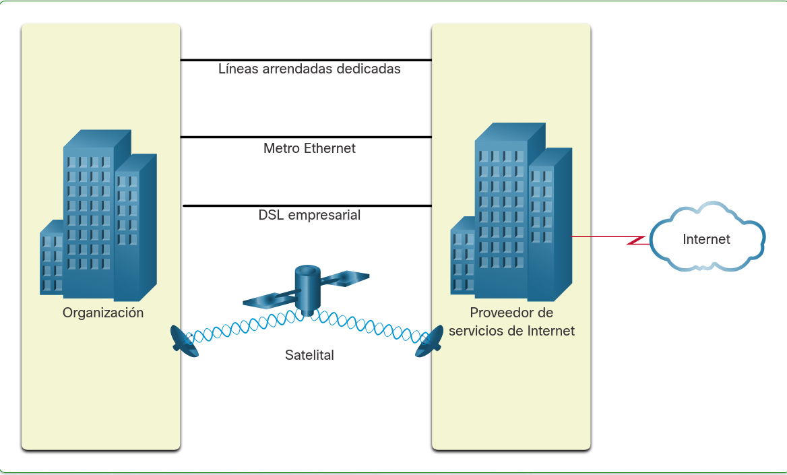

---
| Concepto      | Explicacion    |
| ------------- | ------------- |
| Lineas Arrendadas dedicadas |Las líneas arrendadas son circuitos reservados dentro de la red del proveedor de servicios que conectan oficinas separadas geográficamente para redes privadas de voz y / o datos. Los circuitos se alquilan a una tasa mensual o anual. |
| Metro Ethernet | Esto a veces se conoce como Ethernet WAN. En este módulo, nos referiremos a él como Metro Ethernet. Metro ethernets extienden la tecnología de acceso LAN a la WAN. Ethernet es una tecnología LAN que analizará en un capítulo más adelante.|
| DSL Empresarial |  El servicio de DSL empresarial está disponible en diversos formatos. Una opción muy utilizada es la línea de suscriptor digital simétrica (SDSL), que es similar a la versión de DSL para el consumidor, pero proporciona las mismas velocidades de subida y descarga.|
| Satelital |El servicio satelital puede proporcionar una conexión cuando una solución por cable no está disponible. |
---

**NOTA**: La opciones de conexión varía según la ubicación geográfica y la disponibilidad de proveedores de servicios.

---

# [*] Tema 1.5.4 : La Red Convergente

**Redes separadas tradicionales**:

Piense en una escuela construida hace cuarenta años. En ese entonces, las aulas contaban con conexiones por cable para la red de datos, la red telefónica y la red de vídeo para los televisores. Estas redes separadas no pueden comunicarse entre sí. Cada red utilizaba tecnologías diferentes para transportar la señal de comunicación. Cada red tenía su propio conjunto de reglas y estándares para asegurar una comunicación satisfactoria. Múltiples servicios se ejecutaron en múltiples redes.

---

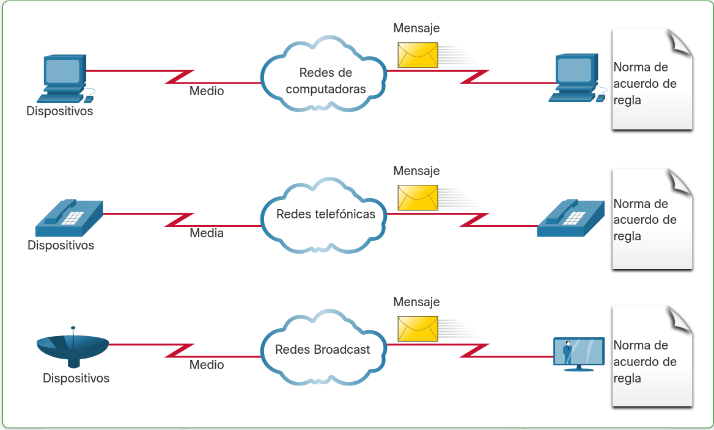

---

**Redes convergentes**:

Hoy, las redes separadas de datos, telefonía y vídeo están convergiendo. A diferencia de las redes dedicadas, las redes convergentes pueden transmitir datos, voz y vídeo entre muchos tipos diferentes de dispositivos en la misma infraestructura de red. Esta infraestructura de red utiliza el mismo conjunto de reglas, acuerdos y estándares de implementación. Las redes de datos convergentes transportan servicios múltiples en una red.

---

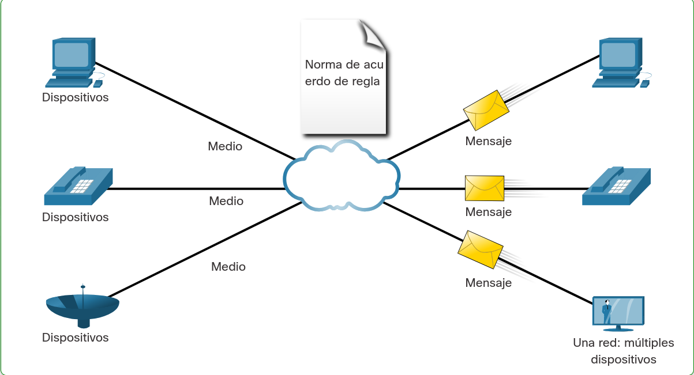

---

# [*] Tema 1.6.1 : Arquitectura de Red

**Introduccion**:

La función de la red cambió de una red únicamente de datos a un sistema que permite conectar personas, dispositivos e información en un entorno de red convergente y con gran variedad de medios. Para que las redes funcionen eficazmente y crezcan en este tipo de entorno, se deben crear sobre la base de una arquitectura de red estándar.

Las redes también admiten una amplia gama de aplicaciones y servicios. Deben operar sobre muchos tipos diferentes de cables y dispositivos, que conforman la infraestructura física. En este contexto, el término arquitectura de red, se refiere a las tecnologías que dan soporte a la infraestructura y a los servicios y las reglas, o protocolos, programados que trasladan los datos a través de la red.

A medida que las redes evolucionan, hemos aprendido que hay cuatro características básicas que los arquitectos de redes deben abordar para cumplir con las expectativas del usuario:

    1 - Tolerancia a Fallas
    2 - Escalabilidad
    3 - Calidad de Servicio (QoS)
    4 - Seguridad

---

# [*] Tema 1.6.2 : Tolerancia a Fallas

**Introduccion**:

Una red tolerante a fallas es aquella que limita la cantidad de dispositivos afectados durante una falla. Está construido para permitir una recuperación rápida cuando se produce una falla de este tipo. Estas redes dependen de varias rutas entre el origen y el destino del mensaje. Si falla una ruta, los mensajes se pueden enviar inmediatamente por otro enlace. El hecho de que haya varias rutas que conducen a un destino se denomina redundancia.

La implementación de una red de packet-switched es una forma en que las redes confiables proporcionan redundancia. La conmutación de paquetes divide el tráfico en paquetes que se enrutan a través de una red compartida. Un solo mensaje, como un correo electrónico o una transmisión de vídeo, se divide en múltiples bloques de mensajes, llamados paquetes. Cada paquete tiene la información de dirección necesaria del origen y el destino del mensaje. Los routers dentro de la red cambian los paquetes según la condición de la red en ese momento. Esto significa que todos los paquetes en un mismo mensaje pueden tomar distintas rutas para llegar a destino. En la figura, el usuario no se da cuenta y no se ve afectado por el cambio dinámico de rutas que hace el router cuando falla un enlace.

---

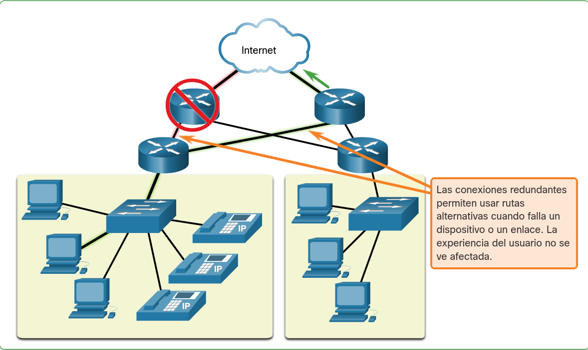

---

# [*] Tema 1.6.3 : Escalabilidad

**Introduccion**:

Una red escalable se expande rápidamente para admitir nuevos usuarios y aplicaciones. Lo hace sin degradar el rendimiento de los servicios a los que están accediendo los usuarios existentes. En la figura, se muestra cómo puede agregarse una red nueva a una red existente con facilidad. Además, las redes son escalables porque los diseñadores siguen los estándares y protocolos aceptados. Esto permite a los proveedores de software y hardware centrarse en mejorar los productos y servicios sin tener que diseñar un nuevo conjunto de reglas para operar dentro de la red.

---

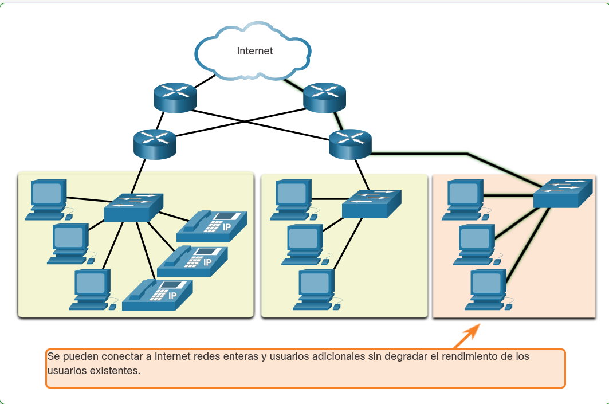

---

# [*] Tema 1.6.4 : Calidad de Servicio

**Introduccion**:

La calidad de servicio (QoS) es un requisito cada vez más importante para las redes hoy en día. Las nuevas aplicaciones disponibles para los usuarios en internetworks, como las transmisiones de voz y de vídeo en vivo generan expectativas más altas sobre la calidad de los servicios que se proporcionan. ¿Alguna vez intentó mirar un vídeo con interrupciones y pausas constantes? A medida que el contenido de datos, voz y vídeo sigue convergiendo en la misma red, QoS se convierte en un mecanismo principal para administrar la congestión y garantizar el envío confiable de contenido a todos los usuarios.

La congestión se produce cuando la demanda de ancho de banda excede la cantidad disponible. El ancho de banda de la red es la medida de la cantidad de bits que se pueden transmitir en un segundo, es decir, bits por segundo (bps). Cuando se producen intentos de comunicaciones simultáneas a través de la red, la demanda de ancho de banda puede exceder su disponibilidad, lo que provoca congestión en la red.

Cuando el volumen de tráfico es mayor de lo que se puede transportar en la red, los dispositivos colocan los paquetes en cola en la memoria hasta que haya recursos disponibles para transmitirlos. En la figura, un usuario solicita una página web y otro está realizando una llamada telefónica. Con una política de QoS, el router puede administrar el flujo de datos y el tráfico de voz, dando prioridad a las comunicaciones de voz si la red se congestiona.

---

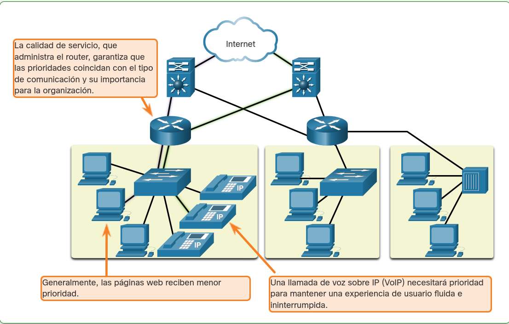

---

# [*] Tema 1.6.5 : Seguridad de la Red

**Introduccion**:

La infraestructura de red, los servicios y los datos contenidos en los dispositivos conectados a la red son activos comerciales y personales muy importantes. Los administradores de red deben abordar dos tipos de problemas de seguridad de red: seguridad de la infraestructura de red y seguridad de la información.

Asegurar la infraestructura de red incluye asegurar físicamente los dispositivos que proporcionan conectividad de red y evitar el acceso no autorizado al software de administración que reside en ellos, como se muestra en la figura.

---

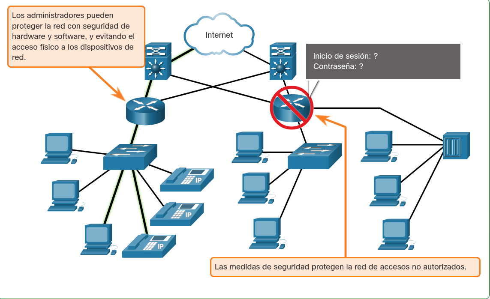

---

Los administradores de red también deben proteger la información contenida en los paquetes que se transmiten a través de la red y la información almacenada en los dispositivos conectados a la red. Para alcanzar los objetivos de seguridad de la red, hay tres requisitos principales

---
| Requisito     | Explicacion   |
| ------------- | ------------- |
| Confidencialidad | La confidencialidad de los datos se refiere a que solamente los destinatarios deseados y autorizados pueden acceder a los datos y leerlos. |
| Integridad | Integridad de datos significa tener la seguridad de que la información no se va a alterar en la transmisión, del origen al destino. |
| Disponibilidad |Significa tener la seguridad de acceder en forma confiable y oportuna a los servicios de datos para usuarios autorizados. |
---

# [*] Tema 1.7.1 : Tendencias Recientes

**Introduccion**:

A medida que se lanzan al mercado nuevas tecnologías y dispositivos para usuarios finales, las empresas y los consumidores deben continuar adaptándose a este entorno en constante evolución. Existen varias tendencias de redes que afectan a organizaciones y consumidores:

    1 - Traiga su propio dispositivo (BYOD)
    2 - Colaboracion en Linea
    3 - Comunicaciones de video
    4 - Computacion en la nube

---

# [*] Tema 1.7.2 : Traiga su Propio Dispositivo (BYOD)

**Introduccion**:

El concepto de cualquier dispositivo, para cualquier contenido, de cualquier manera, es una tendencia global importante que requiere cambios significativos en la forma en que usamos los dispositivos y los conectamos de manera segura a las redes. Esto se llama Traiga su propio dispositivo (BYOD).

BYOD permite a los usuarios finales la libertad de usar herramientas personales para acceder a la información y comunicarse a través de una red de negocios o campus. Con el crecimiento de los dispositivos de consumo y la caída relacionada en el costo, los empleados y estudiantes pueden tener dispositivos avanzados de computación y redes para uso personal. Estos incluyen computadoras portátiles, tabletas, teléfonos inteligentes y lectores electrónicos. Estos pueden ser comprados por la compañía o la escuela, comprados por el individuo, o ambos.

BYOD significa que se puede usar cualquier dispositivo, de cualquier persona, en cualquier lugar.

---

# [*] Tema 1.7.3 : Colaboracion en Linea

**Introduccion**:

Las personas quieren conectarse a la red no solo para acceder a aplicaciones de datos, sino también para colaborar entre sí. La colaboración se define como “el acto de trabajar con otras personas en un proyecto conjunto”. Las herramientas de colaboración, como Cisco Webex que se muestra en la figura, brindan a los empleados, estudiantes, profesores, clientes y asociados una forma de conectarse, interactuar y lograr sus objetivos de forma inmediata.

---

# [*] Tema 1.7.4 : Comunicaciones de Video

**Introduccion**:

Otra faceta de las redes que es crítica para el esfuerzo de comunicación y colaboración es el video. El video se usa para comunicaciones, colaboración y entretenimiento. Las videollamadas se realizan desde y hacia cualquier persona con conexión a Internet, independientemente de dónde se encuentren.

La videoconferencia es una herramienta poderosa para comunicarse con otros, tanto local como globalmente. A medida que las organizaciones se extienden más allá de los límites geográficos y culturales, el vídeo se convierte en un requisito crítico para una colaboración eficaz.

---

# [*] Tema 1.7.6 : Computacion en la Nube

**Introduccion**:

La informática en la nube es una de las formas en que accedemos y almacenamos datos. La computación en la nube nos permite almacenar archivos personales, incluso hacer copias de seguridad de una unidad completa en servidores a través de Internet. Se puede acceder a aplicaciones como procesamiento de texto y edición de fotos usando la nube.

Para las empresas, la computación en la nube amplía las capacidades de TI sin requerir inversión en nueva infraestructura, capacitación de personal nuevo o licencias de software nuevo. Estos servicios están disponibles a petición y se proporcionan de forma económica a cualquier dispositivo en cualquier lugar del mundo, sin comprometer la seguridad ni el funcionamiento.

La computación en la nube es posible gracias a los centros de datos. Los centros de datos son instalaciones utilizadas para alojar sistemas informáticos y componentes asociados. Un centro de datos puede ocupar una habitación de un edificio, uno o más pisos o un edificio completo del tamaño de un almacén. Por lo general, la creación y el mantenimiento de centros de datos son muy costosos. Por esta razón, solo las grandes organizaciones utilizan centros de datos privados creados para alojar sus datos y proporcionar servicios a los usuarios. Las organizaciones más pequeñas que no pueden mantener su propio centro de datos privado pueden reducir el costo total de propiedad mediante el arrendamiento de servicios de servidor y almacenamiento a una organización de centro de datos más grande en la nube.

Por motivos de seguridad, fiabilidad y tolerancia a fallos, los proveedores de nube suelen almacenar datos en centros de datos distribuidos. En lugar de almacenar todos los datos de una persona u organización en un centro de datos, se almacenan en varios centros de datos en diferentes ubicaciones.

---

**Cloud Types**:

---

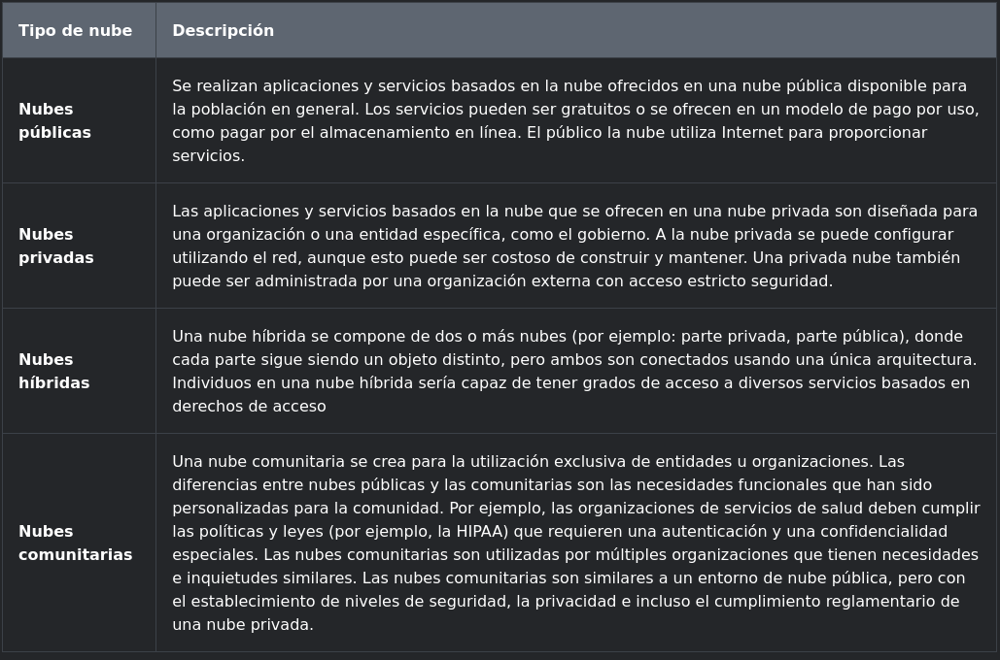

---

# [*] Tema 1.7.7 : Tendencias Tecnologicas en el Hogar

**Introduccion**:

Las tendencias de las redes no solo afectan la forma en que nos comunicamos en el trabajo y en la escuela, sino que también cambian muchos aspectos del hogar. Las nuevas tendencias del hogar incluyen la “tecnología del hogar inteligente”.

La tecnología de hogar inteligente se está desarrollando actualmente para todas las habitaciones dentro de una casa. La tecnología inteligente para el hogar se volverá más común a medida que se expandan las redes domésticas y la tecnología de Internet de alta velocidad.

---

# [*] Tema 1.7.8 : Tendencias Tecnologicas en el Hogar

**Introduccion**:

Las redes Powerline para redes domésticas utilizan el cableado eléctrico existente para conectar dispositivos, como se muestra en la figura.

---

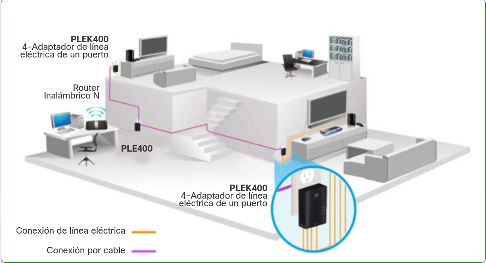

---

Mediante un adaptador estándar de línea eléctrica, los dispositivos pueden conectarse a la LAN donde haya un tomacorriente. No es necesario instalar cables de datos, y se utiliza poca o ninguna electricidad adicional. Mediante el uso de los mismos cables que transmiten electricidad, la red de línea de alimentación envía información mediante el envío de datos en ciertas frecuencias.

La red Powerline es especialmente útil cuando los puntos de acceso inalámbrico no pueden llegar a todos los dispositivos en el hogar. La red Powerline no es un sustituto del cableado dedicado en redes de datos. Sin embargo, es una alternativa cuando los cables de red de datos o las comunicaciones inalámbricas no son posibles o efectivas.

---

# [*] Tema 1.7.8 : Banda ancha inalambrica

**Introduccion**:

En muchas áreas donde el cable y el DSL no están disponibles, es posible que la conexión inalámbrica se utilice para conectarse a Internet.

---

**Proveedor de servicios de Internet inalámbrico**

El proveedor de servicios de Internet inalámbrico (WISP) es un ISP que conecta a los suscriptores a un punto de acceso designado o una zona activa mediante tecnologías inalámbricas similares a las que se encuentran en las redes de área local inalámbrica (WLAN). Los WISP se encuentran con mayor frecuencia en entornos rurales donde los servicios de cable o DSL no están disponibles.

Aunque se puede instalar una torre de transmisión separada para la antena, típicamente la antena está unida a una estructura elevada existente, como una torre de agua o una torre de radio. Se instala una pequeña antena en el techo del suscriptor, al alcance del transmisor del WISP. La unidad de acceso del suscriptor se conecta a la red conectada por cable dentro del hogar. Desde la perspectiva del usuario doméstico, la configuración no es muy diferente de la de DSL o el servicio de cable. La diferencia principal es que la conexión del hogar al ISP es inalámbrica, en lugar de establecerse mediante un cable físico.

---

**Servicio de banda ancha inalámbrica**

Otra solución inalámbrica para los hogares y las pequeñas empresas es la banda ancha inalámbrica, como se muestra en la figura.

---

# [*] Tema 1.8.1 : Amenazas de Seguridad

**Introduccion**:

Sin duda, ha escuchado o leído noticias sobre la violación de la red de una empresa, lo que brinda a los atacantes acceso a la información personal de miles de clientes. Por esta razón, la seguridad de la red siempre va a ser una prioridad de los administradores.

La seguridad de la red es una parte integral de la red informática, independientemente de si la red está en un hogar con una sola conexión a Internet o es una corporación con miles de usuarios. La seguridad de la red debe tener en cuenta el entorno, así como las herramientas y requisitos de la red. Debe ser capaz de proteger los datos al tiempo que permite la calidad de servicio que los usuarios esperan de la red.

Asegurar una red implica protocolos, tecnologías, dispositivos, herramientas y técnicas para proteger los datos y mitigar las amenazas. Los vectores de amenazas pueden ser externos o internos. Muchas amenazas de seguridad de redes externas se originan hoy en Internet.

---

| Tipo de Amenaza    | Explicacion     |
| ------- | ------------ |
|   Virus, gusanos y caballos de Troya       |Estos contienen software malicioso o código que se ejecuta en un dispositivo de usuario.          | 
|Spyware y adware         | Estos son tipos de software que se instalan en el dispositivo de un usuario. El software recopila en secreto información sobre el usuario.
|Ataques de día cero     | También llamados ataques de hora cero, se producen el primer día que se conoce una vulnerabilidad
|Amenazas de Atacantes         |una persona malintencionada ataca dispositivos de usuario o recursos de red.
|Ataques por denegación de servicio|Estos ataques ralentizan o bloquean las aplicaciones y procesos en un dispositivo de red.
|Intercepción y robo de datos|Este ataque captura información privada de la red de una organización.
|Robo de identidad|Este ataque roba las credenciales de inicio de sesión de un usuario para acceder a datos privados.

---
**NOTA**: También es importante tener en cuenta las amenazas internas. Se llevaron a cabo numerosos estudios que muestran que las violaciones de datos más comunes suceden a causa de los usuarios internos de la red. Esto se puede atribuir a dispositivos perdidos o robados o al mal uso accidental por parte de los empleados, y dentro del entorno comercial, incluso a empleados maliciosos. Con las estrategias de BYOD en desarrollo, los datos corporativos son mucho más vulnerables. Por lo tanto, al desarrollar una política de seguridad, es importante abordar las amenazas de seguridad internas y externas, como se muestra en la figura.

---

# [*] Tema 1.8.2 : Soluciones de Seguridad

**Introduccion**:

No hay una solución única que pueda proteger una red contra la variedad de amenazas que existen. Por este motivo, la seguridad debe implementarse en varias capas, y debe utilizarse más de una solución de seguridad. Si un componente de seguridad no puede identificar y proteger la red, otros pueden tener éxito.

En general, la implementación de seguridad de las redes domésticas es muy básica. Por lo general, lo implementa en los dispositivos finales, así como en el punto de conexión a Internet, e incluso puede confiar en los servicios contratados por el ISP.

---

Estos son los componentes básicos de seguridad para una red doméstica o de oficina pequeña:

    1 - Antivirus y antispyware: Estas aplicaciones ayudan a proteger los dispositivos finales para que no se infecten con software malicioso.

    2 - Filtrado de Firewall: El filtrado de firewall bloquea el acceso no autorizado dentro y fuera de la red. Esto puede incluir un sistema de firewall ejecutado en un host que se implemente para impedir el acceso no autorizado al terminal o un servicio de filtrado básico en el router doméstico para impedir el acceso no autorizado del mundo exterior a la red.

---

Por otra parte, la implementación de seguridad de la red en redes de las empresas normalmente consiste en la integración de numerosos componentes a la red para controlar y filtrar el tráfico. Lo ideal es que todos los componentes funcionen juntos, lo que minimiza la necesidad de mantenimiento y aumenta la seguridad. Las redes más grandes y las redes corporativas utilizan filtros antivirus, antispyware y firewall, pero también tienen otros requisitos de seguridad:

| Requisitos    | Explicacion | 
| ------- | ------------ | 
| Sistemas de firewall dedicados | Estos proporcionan capacidades de firewall más avanzadas que pueden filtrar grandes cantidades de tráfico con más granularidad. | 
|Listas de control de acceso (ACL)|Estos filtran aún más el acceso y el reenvío de tráfico en función de las direcciones IP y las aplicaciones.
|Sistemas de prevención de intrusiones (IPS)|Estos identifican amenazas de rápida propagación, como ataques de día cero o de hora cero.
|Redes Privadas Virtuales (VPN)|Estos proporcionan acceso seguro a una organización para trabajadores remotos.

---

Los requisitos de seguridad de la red deben tener en cuenta el entorno, así como las diversas aplicaciones y los requisitos informáticos. Tanto el entorno doméstico como el empresarial deben poder proteger sus datos y, al mismo tiempo, permitir la calidad de servicio que los usuarios esperan de cada tecnología. Además, la solución de seguridad implementada debe poder adaptarse a las crecientes tendencias de red, en constante cambio.

El estudio de las amenazas de seguridad de red y de las técnicas de mitigación comienza con una comprensión clara de la infraestructura de switching y routing subyacente utilizada para organizar los servicios de red.

---

