# Modulo # 2 : Configuración Básica de Switches y Terminales.

# [*] Tema 2.1.1 : Acceso a Cisco IOS

**Introduccion** : 

Todos los dispositivos finales y dispositivos de red requieren un sistema operativo (OS). Como se muestra en la figura, la parte del Sistema Operativo que interactúa directamente con el hardware de la PC se conoce como kernel. La parte que interactúa con las aplicaciones y el usuario se conoce como shell. El usuario puede interactuar con el shell mediante la interfaz de línea de comandos (CLI) o la interfaz gráfica del usuario (GUI).

---


---

Cuando se usa una CLI, el usuario interactúa directamente con el sistema en un entorno basado en texto ingresando comandos en el teclado en un símbolo del sistema, como se muestra en el ejemplo. El sistema ejecuta el comando y, por lo general, proporciona una respuesta en forma de texto. La CLI necesita muy poca sobrecarga para operar. Sin embargo, exige que el usuario tenga conocimientos de la estructura subyacente que controla el sistema.

```
analyst@secOps ~]$ ls
Desktop Downloads lab.support.files second_drive
[analyst@secOps ~]$ 
```

# [*] Tema 2.1.2 : GUI

Una GUI como Windows, macOS, Linux KDE, Apple iOS o Android le permite al usuario interactuar con el sistema utilizando un entorno de iconos gráficos, menús y ventanas. The GUI example in the figure is more user-friendly and requires less knowledge of the underlying command structure that controls the system. Por este motivo, muchas personas prefieren los entornos GUI.

---

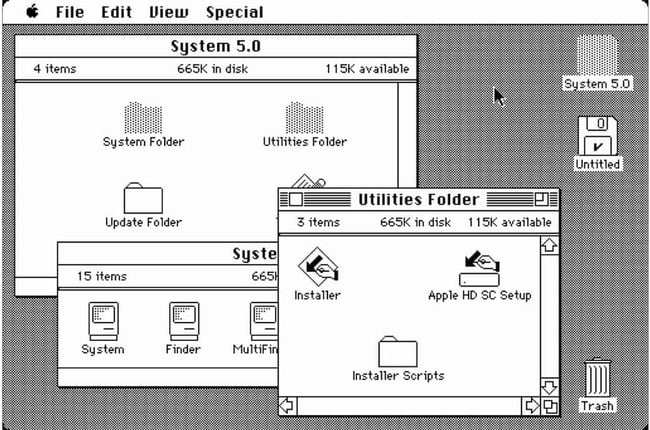

---

Sin embargo, las GUI no siempre pueden proporcionar todas las funcionalidades que hay disponibles en la CLI. Las GUI también pueden fallar, colapsar o simplemente no operar como se les indica. Por eso, se suele acceder a los dispositivos de red mediante una CLI. La CLI consume menos recursos y es muy estable en comparación con una GUI.

La familia de sistemas operativos de red utilizados en muchos dispositivos Cisco se llama Cisco Internetwork Operating System (IOS). Cisco IOS se utiliza en muchos routers y switches de Cisco, independientemente del tipo o tamaño del dispositivo. Cada router o tipo de switch de dispositivo utiliza una versión diferente de Cisco IOS. Otros sistemas operativos de Cisco incluyen IOS XE, IOS XR y NX-OS.

Nota: El sistema operativo de los routers domésticos generalmente se denomina firmware. El método más frecuente para configurar un router doméstico consiste en utilizar un explorador web para acceder a una GUI.

# [*] Tema 2.1.3 : Proposito del OS

Los sistemas operativos de red son similares al sistema operativo de una PC. Mediante una GUI, un sistema operativo de PC permite que el usuario realice lo siguiente:

1. Utilice un mouse para hacer selecciones y ejecutar programas.
2. Introduzca texto y comandos de texto.
3. Vea resultados en un monitor.

Un sistema operativo basado en CLI como el Cisco IOS en un switch o router, permite que un técnico de red realice lo siguiente:

1. Utilice un teclado para ejecutar programas de red basados en la CLI.
2. Utilice un teclado para introducir texto y comandos basados en texto.
3. Vea resultados en un monitor.

Los dispositivos de red de Cisco ejecutan versiones especiales de Cisco IOS. La versión de IOS depende del tipo de dispositivo que se utilice y de las características necesarias. Si bien todos los dispositivos traen un IOS y un conjunto de características predeterminados, es posible actualizar el conjunto de características o la versión de IOS para obtener capacidades adicionales.

# [*] Tema 2.1.4 : Métodos de Acceso

Un switch reenviará el tráfico de forma predeterminada y no necesita configurarse explícitamente para funcionar. Por ejemplo, dos hosts configurados conectados al mismo switch nuevo podrían comunicarse.

Independientemente del comportamiento predeterminado de un switch nuevo, todos los switches deben estar configurados y protegidos.

---

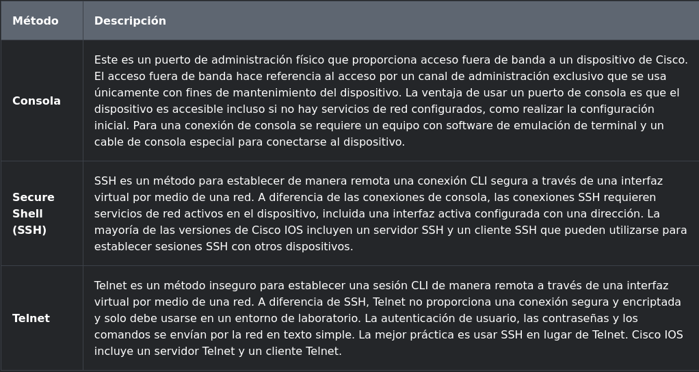

---

Nota: Algunos dispositivos, como los routers, también pueden admitir un puerto heredado auxiliar utilizado para establecer una sesión CLI de forma remota a través de una conexión telefónica utilizando un módem. Al igual que la conexión de consola, el puerto auxiliar también es una conexión fuera de banda y no requiere la configuración ni la disponibilidad de ningún servicio de red.

# Tema [*] 2.1.5 : Programas de Emulación de Terminal

Existen varios programas de emulación de terminal que puede usar para conectarse a un dispositivo de red, ya sea mediante una conexión en serie a través de un puerto de consola o mediante una conexión SSH / Telnet. Estos programas le permiten aumentar la productividad mediante ajustes del tamaño de la ventana, modificaciones de los tamaños de fuente y cambios en los esquemas de colores.

---

|Concepto  | Imagen |
|----------|--------|
|PuTTY     |  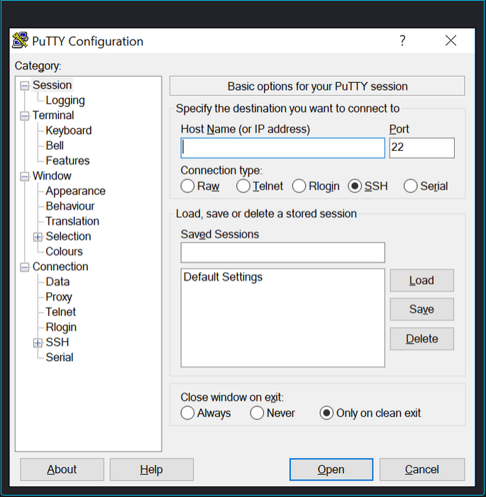      |
|Tera Term |  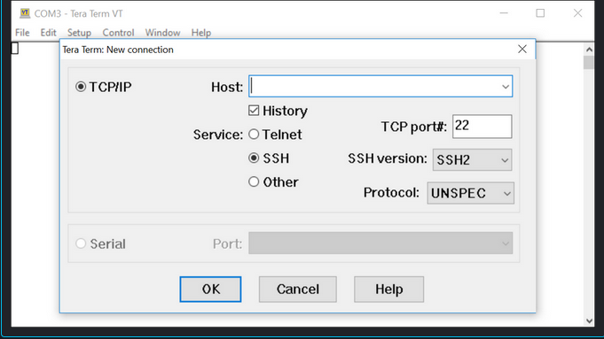      |
|SecureCRT |   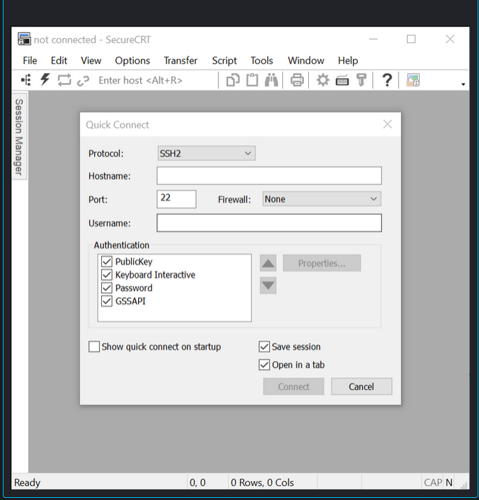     |

---

# [*] Tema 2.2.1 : Modos de Comando Principales

En el tema anterior, aprendió que todos los dispositivos de red requieren un sistema operativo y que se pueden configurar mediante la CLI o una GUI. El uso de la CLI puede proporcionar al administrador de red un control y flexibilidad más precisos que el uso de la GUI. En este tema se describe el uso de CLI para navegar por Cisco IOS.

Como característica de seguridad, el software IOS de Cisco divide el acceso de administración en los siguientes dos modos de comando:

1. Modo de ejecución de usuario - Este tiene capacidades limitadas pero resulta útil en el caso de algunas operaciones básicas. Permite solo una cantidad limitada de comandos de monitoreo básicos, pero no permite la ejecución de ningún comando que podría cambiar la configuración del dispositivo. El modo EXEC del usuario se puede reconocer por la petición de entrada de la CLI que termina con el símbolo >.

2. Modo de ejecución privilegiado - Para ejecutar comandos de configuración, un administrador de redes debe acceder al modo de ejecución privilegiado. Solo se puede ingresar al modo de configuración global y a los modos de configuración más altos por medio del modo EXEC con privilegios. El modo EXEC con privilegios se puede reconocer por la petición de entrada que termina con el # símbolo.


---

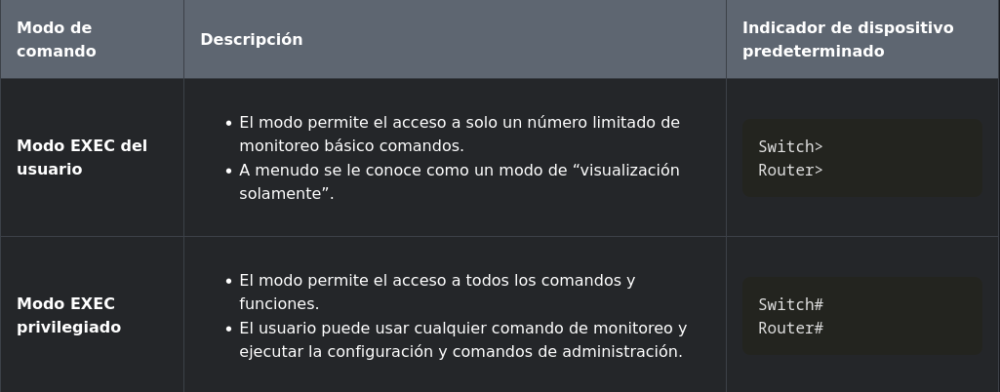

---

# [*] Tema 2.2.2 : Modo de Configuración y modos de subconfiguración

Para configurar el dispositivo, el usuario debe ingresar al modo de configuración global, que normalmente se denomina modo de config. global.

Desde el modo de configuración global, se realizan cambios en la configuración de la CLI que afectan la operación del dispositivo en su totalidad. El modo de configuración global se identifica mediante un mensaje que termina (config)# después del nombre del dispositivo, como Switch(config)#.

Antes de acceder a otros modos de configuración específicos, se accede al modo de configuración global. Desde el modo de configuración global, el usuario puede ingresar a diferentes modos de subconfiguración. Cada uno de estos modos permite la configuración de una parte o función específica del dispositivo IOS. Dos modos de subconfiguración comunes incluyen:

1. Modo de configuración de líneas - Se utiliza para configurar la consola, SSH, Telnet o el acceso auxiliar.

2. Modo de configuración de interfaz - Se utiliza para configurar un puerto de switch o una interfaz de red de router.

Cuando se utiliza la CLI, el modo se identifica mediante la línea de comandos que es exclusiva de ese modo. De manera predeterminada, cada petición de entrada empieza con el nombre del dispositivo. Después del nombre, el resto de la petición de entrada indica el modo. Por ejemplo, el indicador predeterminado para el modo de configuración de línea es Switch(config-line)# and the default prompt for interface configuration mode is Switch(config-if)#.

# [*] Tema 2.2.4 : Navegación entre los modos de IOS

Se utilizan varios comandos para pasar dentro o fuera de los comandos de petición de entrada. Para pasar del modo EXEC del usuario al modo EXEC con privilegios, ingrese el enable comando. Utilice el disable comando del modo EXEC privilegiado para volver al modo EXEC del usuario.

Para entrar y salir del modo de configuración global, use el comando configure terminal del modo EXEC privilegiado. Para volver al modo EXEC privilegiado, ingrese el comando del modo exit de configuración global.

Existen diversos tipos de modos de subconfiguración. Por ejemplo, para ingresar al modo de subconfiguración de línea, use el comando line seguido del tipo de línea de administración y el número al que desea acceder. Use el comando exit para salir de un modo de subconfiguración y volver al modo de configuración global.

```

Switch(config)# line console 0
Switch(config-line)# exit
Switch(config)#

```

Para pasar de cualquier modo de subconfiguración del modo de configuración global al modo un paso por encima de él en la jerarquía de modos, ingrese el comando exit.

Para pasar de cualquier modo de subconfiguración al modo EXEC privilegiado, ingrese el comando end o ingrese la combinación de teclas. Ctrl+Z.

```

Switch(config-line)# end
Switch#

```

Puede trasladarse directamente desde un modo de subconfiguración a otro. Vea cómo después de seleccionar una interfaz, el comando de petición cambia de**(config-line)#** to (config-if)#.

```

Switch(config-line)# interface FastEthernet 0/1
Switch(config-if)#

```

# [*] Tema 2.2.6 : Una nota sobre las actividades del verificador de sintaxis

Cuando esté aprendiendo a modificar las configuraciones de los dispositivos, es posible que desee comenzar en un entorno seguro que no sea de producción antes de probarlo en equipos reales. NetaCAD le ofrece diferentes herramientas de simulación para ayudarle a desarrollar sus habilidades de configuración y solución de problemas. Debido a que se trata de herramientas de simulación, normalmente no tienen toda la funcionalidad del equipo real. Una de esas herramientas es el Comprobador de sintaxis. En cada Comprobador de sintaxis, se le da un conjunto de instrucciones para introducir un conjunto específico de comandos. No puede progresar en el Comprobador de sintaxis a menos que se introduzca el comando exacto y completo como se especifica. Las herramientas de simulación más avanzadas, como Packet Tracer, le permiten introducir comandos abreviados, como lo haría con equipos reales.

# [*] Tema 2.3.1 : Estructura Básica de Comandos de IOS

Este tema cubre la estructura básica de los comandos para Cisco IOS. Un administrador de red debe conocer la estructura de comandos básica del IOS para poder usar la CLI para la configuración del dispositivo.

Los dispositivos Cisco IOS admiten muchos comandos. Cada comando de IOS tiene una sintaxis o formato específico y puede ejecutarse solamente en el modo adecuado. La sintaxis general para un comando, que se muestra en la figura, es el comando seguido de cualquier palabra clave y argumento apropiados.

---

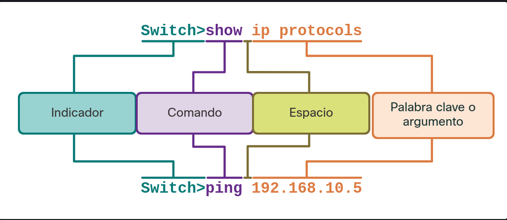

---

1. Palabra clave (Keyword) - Esto es un parámetro específico definido en el sistema operativo (en la figura, ip protocols).
2. Argumento - Esto no está predefinido; es un valor o variable definida por el usuario (en la figura, 192.168.10.5).

Después de ingresar cada comando completo, incluidas las palabras clave y los argumentos, presione la Enter tecla para enviar el comando al intérprete de comandos.

# [*] Tema 2.3.2 : Comprobación de la sintaxis del comando de IOS

Un comando podría requerir uno o más argumentos. Para determinar cuáles son las palabras clave y los argumentos requeridos para un comando, consulte la sintaxis de comandos. La sintaxis proporciona el patrón o el formato que se debe utilizar cuando se introduce un comando.

Como se identifica en la tabla, el texto en negrita indica los comandos y las palabras clave que se ingresan como se muestra. El texto en cursiva indica los argumentos para los cuales el usuario proporciona el valor.

---

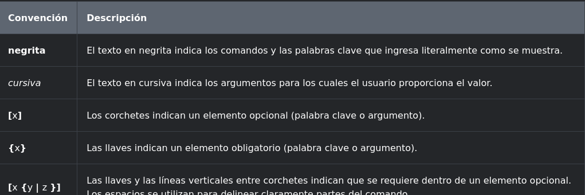

---

Por ejemplo, la sintaxis para utilizar el description comando es description string. El argumento es un valor string proporcionado por el usuario. description El comando se usa típicamente para identificar el propósito de una interfaz. Por ejemplo, al ingresar el comando, description Connects to the main headquarter office switch, se describe dónde se encuentra el otro dispositivo al final de la conexión.

Los siguientes ejemplos muestran algunas convenciones utilizadas para registrar y usar comandos de IOS:

1. ping ip-address - The command is ping and the user-defined argument is the ip-address of the destination device. For example, ping 10.10.5.
2.traceroute ip-address - The command is traceroute and the user-defined argument is the ip-address of the destination device. For example, traceroute 192.168.254.254.

Si un comando es complejo con múltiples argumentos, puede verlo representado así:

```
Switch(config-if)# switchport port-security aging {  static | time time |     type   {absolute | inactivity}

```

El comando normalmente se seguirá una descripción detallada del comando y cada argumento.

La referencia de comando de Cisco IOS es la última fuente de información para un comando de IOS en particular.

# [*] Tema 2.3.3 : Funciones de Ayuda de IOS

El IOS tiene dos formas de ayuda disponibles: la ayuda contextual y el verificador de sintaxis de comandos.

La ayuda contextual le permite encontrar rápidamente respuestas a estas preguntas:

* ¿ Qué comandos están disponibles en cada modo de comando?
* ¿ Qué comandos comienzan con caracteres específicos o grupo de caracteres?
* ¿ Qué argumentos y palabras clave están disponibles para comandos particulares?

Para acceder a la ayuda contextual, simplemente ingrese un signo de interrogación, en la CLI. ?

La verificación de la sintaxis del comando comprueba que el usuario haya introducido un comando válido. Cuando se introduce un comando, el intérprete de la línea de comandos analiza al comando de izquierda a derecha. Si el intérprete comprende el comando, la acción requerida se ejecuta y la CLI vuelve a la petición de entrada correspondiente. Sin embargo, si el intérprete no puede comprender el comando que se ingresa, mostrará un comentario que describe el error del comando.

# [*] Tema 2.3.5 : Teclas de Acceso Rápido y métodos abreviados

La CLI de IOS proporciona teclas de acceso rápido y accesos directos que facilitan la configuración, el monitoreo y la solución de problemas.

Los comandos y las palabras clave pueden acortarse a la cantidad mínima de caracteres que identifica a una selección única. Por ejemplo, el configure comando se puede acortar a conf porque configure es el único comando que comienza con conf. Una versión aún más corta con, no funcionará porque más de un comando comienza con con. Las palabras clave también pueden acortarse.

La tabla muestra las pulsaciones de teclas para mejorar la edición de la línea de comandos.

---

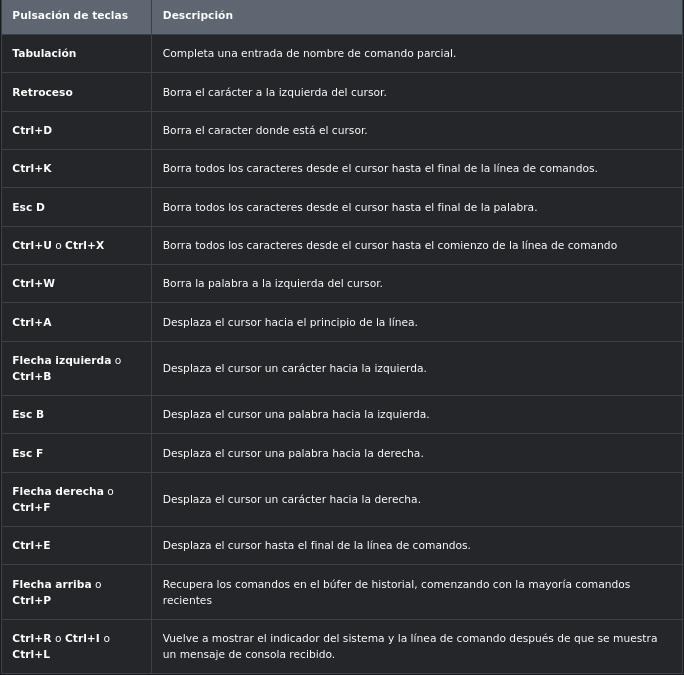

---

Nota: Aunque la Delete clave normalmente elimina el carácter a la derecha de la solicitud, la estructura del comando IOS no reconoce la tecla Eliminar.

Cuando una salida de comando produce más texto del que se puede mostrar en una ventana de terminal, el IOS mostrará una “--More--” solicitud. En la tabla siguiente se describen las pulsaciones de teclas que se pueden utilizar cuando se muestra esta solicitud.

---

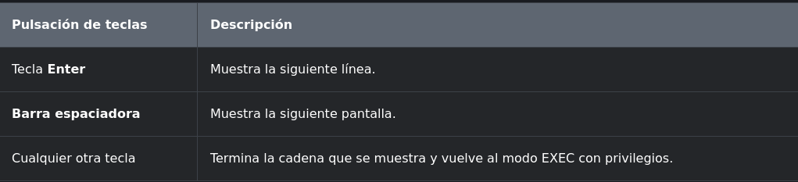

---

En esta tabla se enumeran los comandos utilizados para salir de una operación.


---

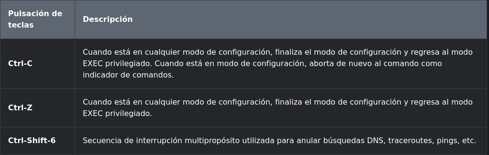

---

# [*] Tema 2.4.1 : Nombres de los dispositivos

Ha aprendido mucho acerca del IOS de Cisco, la navegación del IOS y la estructura de comandos. ¡Ahora, ya está listo para configurar dispositivos! El primer comando de configuración en cualquier dispositivo debe ser darle un nombre de dispositivo único o nombre de host. De forma predeterminada, a todos los dispositivos se les asigna un nombre predeterminado de fábrica. Por ejemplo, un switch Cisco IOS es «Switch.»

El problema es que si todos los switches de una red se quedaran con sus nombres predeterminados, sería difícil identificar un dispositivo específico. Por ejemplo, ¿cómo sabrías que estás conectado al dispositivo correcto al acceder remotamente a través de SSH? El nombre de host proporciona la confirmación de que está conectado al dispositivo correcto.

El nombre predeterminado debe cambiarse a algo más descriptivo. Al elegir nombres atinadamente, resulta más fácil recordar, analizar e identificar los dispositivos de red. Estas son algunas pautas de nomenclatura importantes para los hosts:

*  Comenzar con una letra.
*   No contener espacios.
*   Finalizar con una letra o dígito.
*    Utilizar únicamente letras, dígitos y guiones.
*    Tener menos de 64 caracteres de longitud.

Una organización debe elegir una convención de nomenclatura que haga que sea fácil e intuitivo identificar un dispositivo específico. Los nombres de host utilizados en el IOS del dispositivo conservan el uso de caracteres en mayúscula y minúscula. Por ejemplo, la figura muestra que tres switches, que abarcan tres pisos diferentes, están interconectados en una red. La convención de nomenclatura que se utilizó incorporó la ubicación y el propósito de cada dispositivo. La documentación de red debe explicar cómo se seleccionaron estos nombres para que se pueda seguir el mismo criterio en la denominación de los dispositivos adicionales.


---

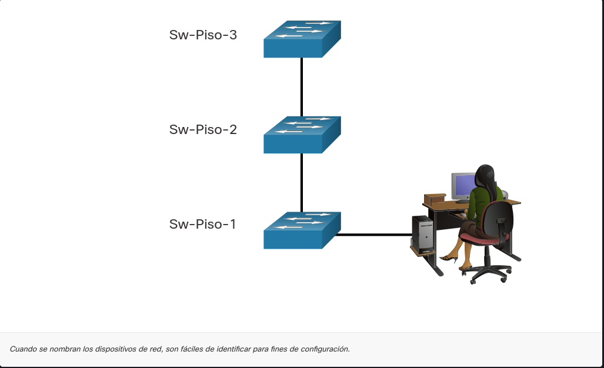

---

Cuando se ha identificado la convención de nomenclatura, el siguiente paso es usar la CLI para aplicar los nombres a los dispositivos. Como se muestra en el ejemplo, desde el modo EXEC privilegiado, acceda al modo de configuración global ingresando el comando. configure terminal Observe el cambio en el comando de petición de entrada.


```

Switch# configure terminal
Switch(config)# hostname Sw-Floor-1
Sw-Floor-1(config)#

```

Desde el modo de configuración global, ingrese el comando hostname seguido del nombre del interruptor y presione. Enter. Observe el cambio en el comando de petición de entrada.

Nota: Para devolver el switch al indicador predeterminado, use el comando de configuración global no hostname.

Siempre asegúrese de que la documentación esté actualizada cada vez que se agrega o modifica un dispositivo. Identifique los dispositivos en la documentación por su ubicación, propósito y dirección.

# [*] Tema 2.4.2 : Pautas de la contraseña

El uso de contraseñas débiles o fácilmente adivinadas sigue siendo la mayor preocupación de seguridad de las organizaciones. Los dispositivos de red, incluso los routers inalámbricos hogareños, siempre deben tener contraseñas configuradas para limitar el acceso administrativo.

Cisco IOS puede configurarse para utilizar contraseñas en modo jerárquico y permitir diferentes privilegios de acceso al dispositivo de red.

Todos los dispositivos de red deben limitar el acceso administrativo asegurando EXEC privilegiado, EXEC de usuario y acceso Telnet remoto con contraseñas. Además, todas las contraseñas deben estar encriptadas y deben proporcionarse notificaciones legales.

Al elegir contraseñas, use contraseñas seguras que no sean fáciles de adivinar. Hay algunos puntos clave a considerar al elegir las contraseñas:

* Use contraseñas que tengan más de ocho caracteres de longitud.
* Use una combinación de letras mayúsculas y minúsculas, números, caracteres especiales o secuencias numéricas.
* Evite el uso de la misma contraseña para todos los dispositivos.
* No use palabras comunes porque se adivinan fácilmente.


Utilice una búsqueda en Internet para encontrar un generador de contraseñas. Muchos le permitirán establecer la longitud, el conjunto de caracteres y otros parámetros.

Nota: Most of the labs in this course use simple passwords such as cisco or class. Estas contraseñas se consideran simples y fáciles de adivinar, y deben evitarse en un entorno de producción. Estas contraseñas solo se utilizan por comodidad en el aula o para ilustrar ejemplos de configuración.

# [*] Tema 2.4.3 : Configuración de contraseñas

Cuando se conecta inicialmente a un dispositivo, se encuentra en modo EXEC de usuario. Este modo está protegido usando la consola.

Para proteger el acceso al modo EXEC del usuario, introduzca el modo de configuración de la consola de línea mediante el comando de configuración line console 0 global, como se muestra en el ejemplo. El cero se utiliza para representar la primera (y en la mayoría de los casos la única) interfaz de consola. Luego, configure la contraseña de modo EXEC de usuario con el comando password password Finalmente, habilite el acceso EXEC de usuario con el comando. login

```
Sw-Floor-1# configure terminal
Sw-Floor-1(config)# line console 0
Sw-Floor-1(config-line)# password cisco
Sw-Floor-1(config-line)# login
SW-Floor-1(config-line)# end
Sw-Floor-1#
```

El acceso a la consola ahora requerirá una contraseña antes de permitir el acceso al modo EXEC del usuario.

Para tener acceso de administrador a todos los comandos del IOS, incluida la configuración de un dispositivo, debe obtener acceso en modo EXEC privilegiado. Es el método de acceso más importante porque proporciona acceso completo al dispositivo.

Para asegurar el acceso privilegiado a EXEC, use el comando enable secret password global config, como se muestra en el ejemplo.

```
Sw-Floor-1# configure terminal
Sw-Floor-1(config)# enable secret class
Sw-Floor-1(config)# exit
Sw-Floor-1#
```

Las líneas de terminal virtual (VTY) permiten el acceso remoto mediante Telnet o SSH al dispositivo. Muchos switches de Cisco admiten hasta 16 líneas VTY que se numeran del 0 al 15.

Para proteger las líneas VTY, introduzca el modo VTY de línea mediante el comando line vty 0 15 global config. Luego, especifique la contraseña de VTY con el comando password password Por último, habilite el acceso a VTY con el comando login

Se muestra un ejemplo de seguridad de las líneas VTY en un switch.

```
Sw-Floor-1# configure terminal
Sw-Floor-1(config)# line vty 0 15
Sw-Floor-1(config-line)# password cisco
Sw-Floor-1(config-line)# login
SW-Floor-1(config-line)# end
Sw-Floor-1#
```

# [*] Tema 2.4.4 : Encriptación de las contraseñas

Los archivos startup-config y running-config muestran la mayoría de las contraseñas en texto simple. Esta es una amenaza de seguridad porque cualquiera puede descubrir las contraseñas si tiene acceso a estos archivos.

Para encriptar todas las contraseñas de texto sin formato, utilice el comando service password-encryption global config como se muestra en el ejemplo.

```
Sw-Floor-1# configure terminal
Sw-Floor-1(config)# service password-encryption
Sw-Floor-1(config)#
```

El comando aplica un cifrado débil a todas las contraseñas no encriptadas. Esta encriptación solo se aplica a las contraseñas del archivo de configuración; no a las contraseñas mientras se envían a través de los medios. El propósito de este comando es evitar que individuos no autorizados vean las contraseñas en el archivo de configuración.

show running-config Use el comando para verificar que las contraseñas estén ahora encriptadas.

```
SW-Floor-1(config)# end
Sw-Floor-1# show running-config
!

!
line con 0
password 7 094F471A1A0A
login
!
line vty 0 4
password 7 03095A0F034F38435B49150A1819
login
!
!
end
```

# [*] Tema 2.4.5 : Mensajes de aviso

Aunque solicitar contraseñas es una forma de mantener al personal no autorizado fuera de la red, es vital proporcionar un método para declarar que solo el personal autorizado debe intentar acceder al dispositivo. Para hacerlo, agregue un aviso a la salida del dispositivo. Los avisos pueden ser una parte importante en los procesos legales en el caso de una demanda por el ingreso no autorizado a un dispositivo. Algunos sistemas legales no permiten la acusación, y ni siquiera el monitoreo de los usuarios, a menos que haya una notificación visible.

Para crear un mensaje de banner del día en un dispositivo de red, use el comando de configuración global banner motd # el mensaje del día #. El símbolo “#” en la sintaxis del comando se denomina carácter delimitador. Se ingresa antes y después del mensaje. El carácter delimitador puede ser cualquier carácter siempre que no aparezca en el mensaje. Por este motivo, a menudo se usan símbolos como "#". Una vez que se ha ejecutado el comando, aparecerá el aviso en todos los intentos posteriores de acceso al dispositivo hasta que el aviso se elimine.

En el ejemplo siguiente se muestran los pasos para configurar el mensaje en Sw-Floor-1.

```
Sw-Floor-1# configure terminal
Sw-Floor-1(config)# banner motd #Authorized Access Only#

```

# [*] Tema 2.5.1 : Archivos de Configuración

Ahora sabe cómo realizar la configuración básica en un switch, incluidas las contraseñas y los mensajes de banner. En este tema se mostrará cómo guardar las configuraciones.

Existen dos archivos de sistema que almacenan la configuración de dispositivos.

*   startup-config - Este es el archivo de configuración guardado que se almacena en NVRAM. Contiene todos los comandos que usará el dispositivo al iniciar o reiniciar. Flash no pierde su contenido cuando el dispositivo está apagado.
* running-config - Esto se almacena en la memoria de acceso aleatorio (RAM). Refleja la configuración actual. La modificación de una configuración en ejecución afecta el funcionamiento de un dispositivo Cisco de inmediato. La memoria RAM es volátil. Pierde todo el contenido cuando el dispositivo se apaga o se reinicia.

El comando de modo EXEC show running-config privilegiado se utiliza para ver la configuración en ejecución. Como se muestra en el ejemplo, el comando mostrará la configuración completa actualmente almacenada en RAM.

```
Sw-Floor-1# show running-config
Building configuration...
Current configuration : 1351 bytes
!
! Last configuration change at 00:01:20 UTC Mon Mar 1 1993
!
version 15.0
no service pad
service timestamps debug datetime msec
service timestamps log datetime msec
service password-encryption
!
hostname Sw-Floor-1
!
(output omitted)
```

Para ver el archivo de configuración de inicio, use el comando show startup-config EXEC privilegiado.

Si se corta la energía al dispositivo o si este se reinicia, se perderán todos los cambios de configuración a menos que se hayan guardado. Para guardar los cambios realizados en la configuración en ejecución en el archivo de configuración de inicio, utilice el comando copy running-config startup-config del modo EXEC privilegiado.

# [*] Tema 2.5.2 : Modificación de la configuración en ejecución

Si los cambios realizados en la configuración en ejecución no tienen el efecto deseado y la configuración en ejecución aún no se ha guardado, puede restaurar el dispositivo a su configuración anterior. Elimine los comandos modificados individualmente o vuelva a cargar el dispositivo con el comando EXEC reload privilegiado para restaurar el startup-config.

La desventaja de usar el reload comando para eliminar una configuración en ejecución no guardada es la breve cantidad de tiempo que el dispositivo estará fuera de línea, causando el tiempo de inactividad de la red.

Cuando se inicia una recarga, el IOS detectará que la configuración en ejecución tiene cambios que no se guardaron en la configuración de inicio. Aparecerá una petición de entrada para preguntar si se desean guardar los cambios. Para descartar los cambios, ingrese n o no.

Alternativamente, si los cambios no deseados se guardaron en la configuración de inicio, puede ser necesario borrar todas las configuraciones. Esto requiere borrar la configuración de inicio y reiniciar el dispositivo. La configuración de inicio se elimina mediante el erase startup-config comando del modo EXEC privilegiado. Una vez que se emite el comando, el switch le solicita confirmación. Press Enter to accept.

Después de eliminar la configuración de inicio de la NVRAM, recargue el dispositivo para eliminar el archivo de configuración actual en ejecución de la memoria RAM. En la recarga, un switch cargará la configuración de inicio predeterminada que se envió originalmente con el dispositivo.

# [*] Tema 2.5.4 : Captura de configuración a un archivo de texto

Los archivos de configuración pueden guardarse y archivarse en un documento de texto. Esta secuencia de pasos asegura la disponibilidad de una copia utilizable del archivo de configuración para su modificación o reutilización en otra oportunidad.

Por ejemplo, suponga que se configuró un switch y que la configuración en ejecución se guardó en el dispositivo.

Paso 1. Abra el software de emulación de terminal, como PuTTY o Tera Term, que ya está conectado a un switch.

---
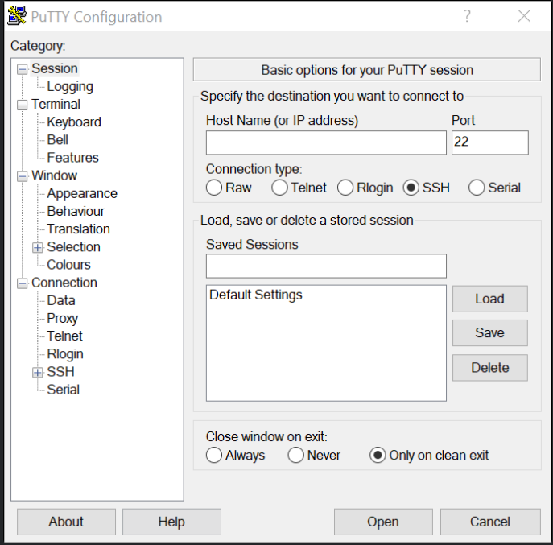

---

Paso 2. Habilite el inicio de sesión en el software del terminal y asigne un nombre y una ubicación de archivo para guardar el archivo de registro. La figura muestra que All session output se capturará en el archivo especificado (es decir, MySwitchLogs).

---

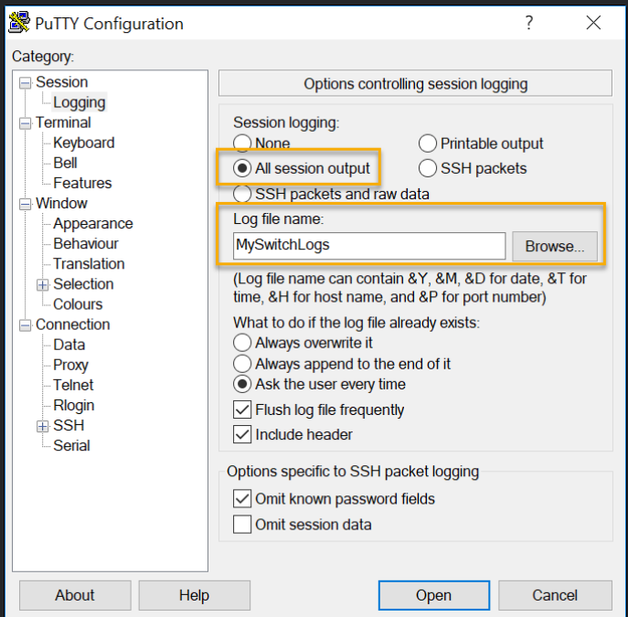

---

Paso 3. Ejecute el show running-config comando show startup-config o en el símbolo EXEC privilegiado. El texto que aparece en la ventana de la terminal se colocará en el archivo elegido.


```
Switch# show running-config
Building configuration...
```

Paso 4. Desactive el inicio de sesión en el software del terminal. La figura muestra cómo deshabilitar el registro seleccionando None la opción de registro de sesión.

---

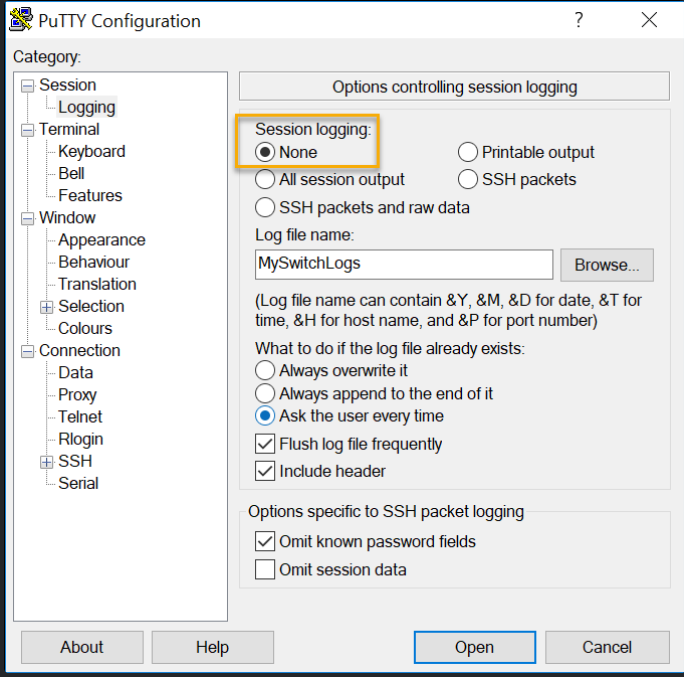


---

El archivo de texto creado se puede utilizar como un registro del modo en que se implementa actualmente el dispositivo. El archivo puede requerir edición antes de poder utilizarse para restaurar una configuración guardada a un dispositivo.

Para restaurar un archivo de configuración a un dispositivo:

Paso 1. Ingrese al modo de configuración global en el dispositivo.

Paso 2. Copie y pegue el archivo de texto en la ventana del terminal conectada al switch.

El texto en el archivo estará aplicado como comandos en la CLI y pasará a ser la configuración en ejecución en el dispositivo. Este es un método conveniente para configurar manualmente un dispositivo.

# [*] Tema 2.6.1 : Direcciones IP


¡Felicitaciones, has realizado una configuración básica del dispositivo! Por supuesto, la diversión aún no ha terminado. Si desea que sus dispositivos finales se comuniquen entre sí, debe asegurarse de que cada uno de ellos tiene una dirección IP adecuada y está correctamente conectado. En este tema encontrará información sobre las direcciones IP, los puertos de dispositivos y los medios utilizados para conectar dispositivos.

El uso de direcciones IP es el principal medio para permitir que los dispositivos se ubiquen entre sí y para establecer la comunicación completa en Internet. Cada terminal en una red se debe configurar con direcciones IP. Los ejemplos de dispositivos finales incluyen estos:

*    PC (estaciones de trabajo, PC portátiles, servidores de archivos, servidores web)
*    Impresoras de red
*    Teléfonos VoIP
*    Cámaras de seguridad
*    Teléfonos inteligentes
*    Dispositivos portátiles móviles        (tal como los escáner inalámbricos para códigos de barras)

La estructura de una dirección IPv4 se denomina notación decimal punteada y se representa con cuatro números decimales entre 0 y 255. Las direcciones IPv4 son números asignados a los dispositivos individuales conectados a una red.

Nota: IP en este curso se refiere a los protocolos IPv4 e IPv6. IPv6 es la versión más reciente de IP y está reemplazando al IPv4 que es más común.

Con la dirección IPv4, también se necesita una máscara de subred. Una máscara de subred IPv4 es un valor de 32 bits que separa la porción de red de la dirección de la porción de host. Junto con la dirección IPv4, la máscara de subred determina a qué subred pertenece el dispositivo.

El ejemplo de la figura muestra la dirección IPv4 (192.168.1.10), la máscara de subred (255.255.255.0) y el gateway predeterminado (192.168.1.1) asignados a un host. La dirección de gateway predeterminado es la dirección IP del router que el host utilizará para acceder a las redes remotas, incluso a Internet.

---

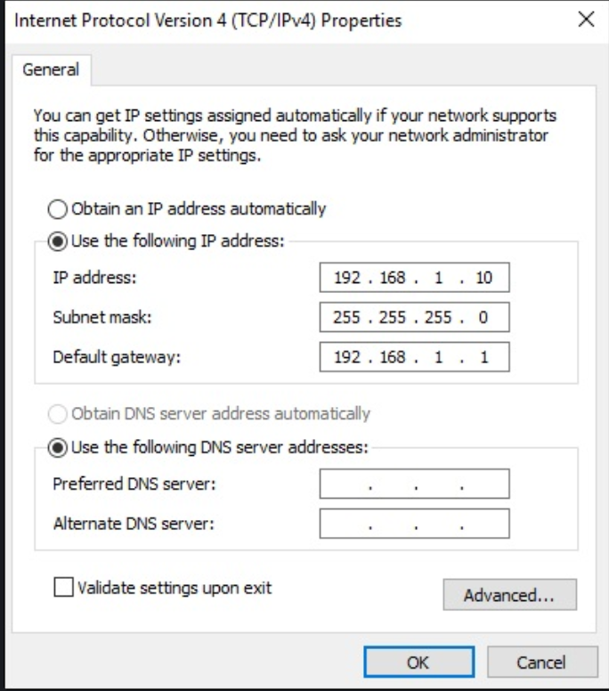

---

Las direcciones IPv6 tienen una longitud de 128 bits y se escriben como una cadena de valores hexadecimales. Cada cuatro bits está representado por un solo dígito hexadecimal; para un total de 32 valores hexadecimales. Los grupos de cuatro dígitos hexadecimales están separados por dos puntos (:). Las direcciones IPv6 no distinguen entre mayúsculas y minúsculas, y pueden escribirse en minúsculas o en mayúsculas.

---

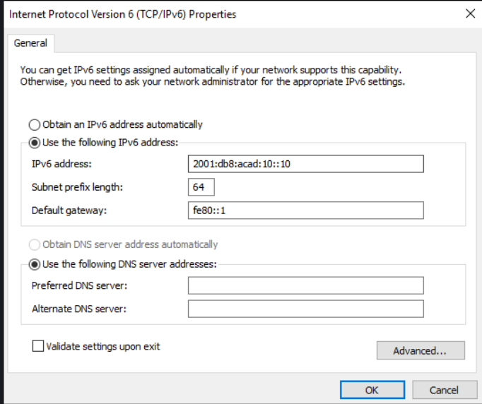

---

# [*] Tema 2.6.2 : Interfaces y puertos

Las comunicaciones de red dependen de las interfaces de los dispositivos para usuarios finales, las interfaces de los dispositivos de red y los cables que las conectan. Cada interfaz física tiene especificaciones o estándares que la definen. Los cables que se conectan a la interfaz deben estar diseñados para cumplir con los estándares físicos de la interfaz. Los tipos de medios de red incluyen los cables de cobre de par trenzado, los cables de fibra óptica, los cables coaxiales o la tecnología inalámbrica, como se muestra en la figura.


---
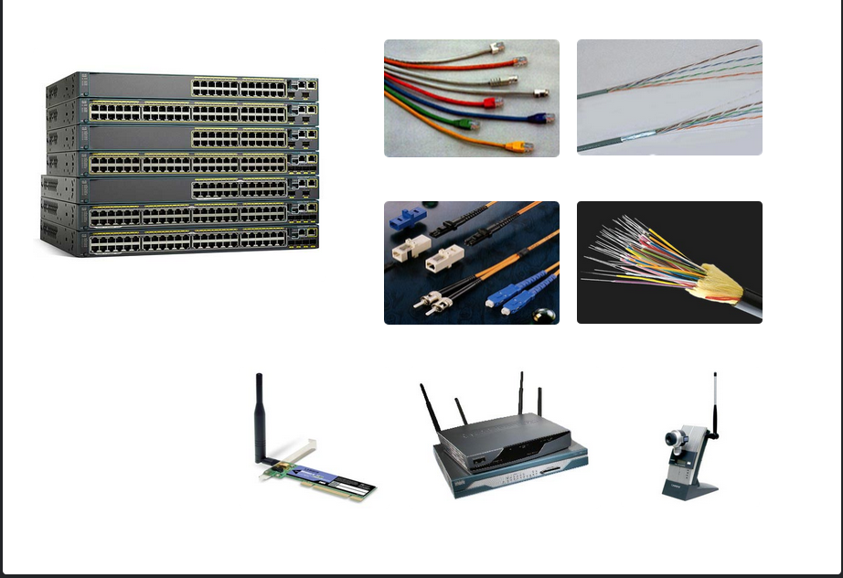

---

Los diferentes tipos de medios de red tienen diferentes características y beneficios. No todos los medios de red tienen las mismas características. No todos los medios son apropiados para el mismo propósito. Estas son algunas de las diferencias entre varios tipos de medios:

*    La distancia a través de la cual los medios pueden transportar una señal correctamente.
*    El ambiente en el cual se instalará el medio.
*    La cantidad de datos y la velocidad a la que se deben transmitir.
*    El costo de los medios y de la instalación.

Cada enlace de Internet no solo requiere un tipo específico de medio de red, sino que también requiere una determinada tecnología de red. Por ejemplo, Ethernet es la tecnología de red de área local (LAN) de uso más frecuente en la actualidad. Hay puertos Ethernet en los dispositivos para usuarios finales, en los dispositivos de switch y en otros dispositivos de red que se pueden conectar físicamente a la red mediante un cable.

Los switches de la capa 2 de Cisco IOS cuentan con puertos físicos para conectar dispositivos. Estos puertos no son compatibles con las direcciones IP de la capa 3. En consecuencia, los switches tienen una o más interfaces virtuales de switch (SVI). Son interfaces virtuales porque no hay hardware físico en el dispositivo asociado a ellas. Una SVI se crea en el software.

La interfaz virtual le permite administrar de forma remota un switch a través de una red utilizando IPv4 e IPv6. Cada switch viene con una SVI que aparece en la configuración predeterminada, fácil de instalar. La SVI predeterminada es interfaz VLAN1.

Nota: Un switch de capa 2 no necesita una dirección IP. La dirección IP asignada a la SVI se utiliza para acceder al switch de forma remota. No se necesita una dirección IP para que el switch realice estas operaciones.

# [*] Tema 2.7.1 : Configuración manual de dirección IP para dispositivos finales

Al igual que necesitas los números de teléfono de tus amigos para enviarles mensajes de texto o llamarlos, los dispositivos finales de tu red necesitan una dirección IP para que puedan comunicarse con otros dispositivos de tu red. En este tema, implementará la conectividad básica configurando el direccionamiento IP en switches y PC.

La información de la dirección IPv4 se puede ingresar en los dispositivos finales de forma manual o automática mediante el Protocolo de configuración dinámica de host (DHCP).

Para configurar manualmente una dirección IPv4 en un host de Windows, abra Control Panel > Network Sharing Center > Change adapter settings y elija el adaptador. A continuación, haga clic con el botón derecho y seleccione Properties para mostrar el Local Area Connection Properties, como se muestra en la figura.

---

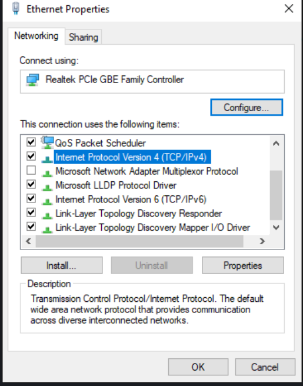

---

Resalte Protocolo de Internet versión 4 (TCP/IPv4) y haga clic Properties para abrir la Internet Protocol Version 4 (TCP/IPv4) Properties ventana, que se muestra en la figura. Configure la información de la dirección IPv4 y la máscara de subred, y el gateway predeterminado.

Nota: Las opciones de configuración y direccionamiento IPv6 son similares a IPv4.

---

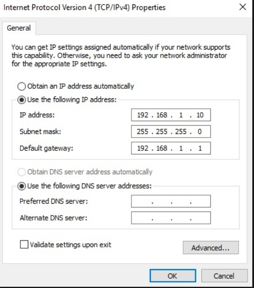

---

Nota: La dirección del servidor DNS es la dirección IPv4 del servidor del sistema de nombres de dominio (DNS), que se utiliza para traducir direcciones IP a direcciones web, como www.cisco.com.

# [*] Tema 2.7.2 : Configuración automática de direcciones IP para dispositivos finales

Los dispositivos finales suelen usar DHCP de manera predeterminada para la configuración automática de la dirección IPv4. DHCP es una tecnología que se utiliza en casi todas las redes. Para comprender mejor por qué DHCP es tan popular, tenga en cuenta todo el trabajo adicional que habría que realizar sin este protocolo.

En una red, DHCP habilita la configuración automática de direcciones IPv4 para cada dispositivo final habilitado para DHCP. Imagine la cantidad de tiempo que le llevaría si cada vez que se conectara a la red tuviera que introducir manualmente la dirección IPv4, la máscara de subred, el gateway predeterminado y el servidor DNS. Multiplique eso por cada usuario y cada uno de los dispositivos en una organización y se dará cuenta del problema. La configuración manual también aumenta las posibilidades de configuraciones incorrectas provocadas por la duplicación de la dirección IPv4 de otro dispositivo.

Como se muestra en la figura, para configurar DHCP en una PC con Windows, solo necesita seleccionar Obtain an IP address automatically y Obtain DNS server address automatically. Su PC buscará un servidor DHCP y se le asignarán los ajustes de dirección necesarios para comunicarse en la red.

Nota: IPv6 utiliza DHCPv6 y SLAAC (configuración automática de direcciones sin estado) para la asignación dinámica de direcciones.

---

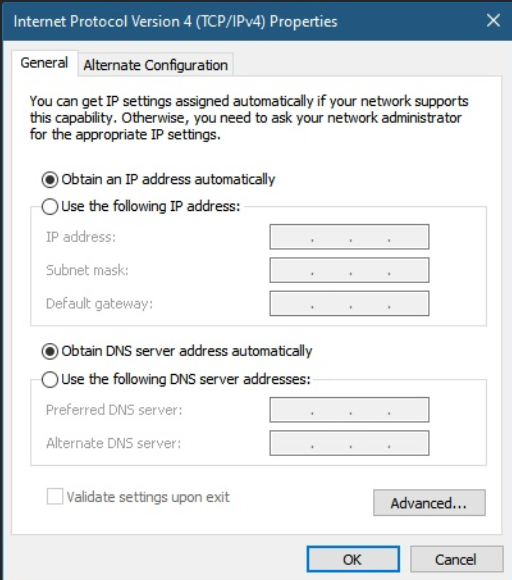

---

# [*] Tema 2.7.4 : Configuración de interfaz virtual de switch

Para acceder al switch de manera remota, se deben configurar una dirección IP y una máscara de subred en la SVI. Para configurar una SVI en un switch, utilice el comando de interface vlan 1 configuración global. La Vlan 1 no es una interfaz física real, sino una virtual. A continuación, asigne una dirección IPv4 mediante el comando ip address ip-address subnet-mask de la configuración de interfaz. Finalmente, habilite la interfaz virtual utilizando el comando de no shutdown configuración de la interfaz.

Una vez que se configuran estos comandos, el switch tiene todos los elementos IPv4 listos para la comunicación a través de la red.

```

Sw-Floor-1# configure terminal
Sw-Floor-1(config)# interface vlan 1
Sw-Floor-1(config-if)# ip address 192.168.1.20 255.255.255.0
Sw-Floor-1(config-if)# no shutdown
Sw-Floor-1(config-if)# exit
Sw-Floor-1(config)# ip default-gateway 192.168.1.1

```

# [*] Tema 2.9.3 : Lo Aprendido en el Modulo

Todos los dispositivos finales y dispositivos de red requieren un sistema operativo (OS). El usuario puede interactuar con el shell mediante una interfaz de línea de comandos (CLI) para utilizar un teclado para ejecutar programas de red basados en CLI, utilizar un teclado para introducir comandos basados en texto y texto y ver los resultados en un monitor.

Como función de seguridad, el software Cisco IOS separa el acceso de administración en los siguientes dos modos de comandos: modo EXEC del usuario y modo EXEC con privilegios.

Antes de acceder a otros modos de configuración específicos, se accede al modo de configuración global. Desde el modo de configuración global, el usuario puede ingresar a diferentes modos de subconfiguración. Cada uno de estos modos permite la configuración de una parte o función específica del dispositivo IOS. Dos modos de subconfiguración comunes incluyen: Modo de configuración de línea y Modo de configuración de interfaz. Para entrar y salir del modo de configuración global, use el comando configure terminal del modo EXEC privilegiado. Para volver al modo EXEC privilegiado, ingrese el comando del modo exit de configuración global.

Cada comando de IOS tiene una sintaxis o formato específico y puede ejecutarse solamente en el modo adecuado. La sintaxis general para un comando es el comando seguido de las palabras clave y los argumentos correspondientes. El IOS tiene dos formas de ayuda disponibles: la ayuda contextual y el verificador de sintaxis de comandos.

El primer comando de configuración en cualquier dispositivo debe ser darle un nombre de dispositivo único o nombre de host. Los dispositivos de red siempre deben tener contraseñas configuradas para limitar el acceso administrativo. Cisco IOS puede configurarse para utilizar contraseñas en modo jerárquico y permitir diferentes privilegios de acceso al dispositivo de red. Configure y encripte todas las contraseñas. Proporcione un método para declarar que solo el personal autorizado debe intentar acceder al dispositivo agregando un banner a la salida del dispositivo.

Hay dos archivos del sistema que almacenan la configuración del dispositivo: startup-config y running-config. Los archivos de configuración en ejecución se pueden modificar si no se han guardado. Los archivos de configuración pueden guardarse y archivarse en un documento de texto.

Las direcciones IP permiten a los dispositivos ubicarse entre sí y establecer una comunicación de extremo a extremo en Internet. Cada terminal en una red se debe configurar con direcciones IP. La estructura de una dirección IPv4 se denomina notación decimal punteada y se representa con cuatro números decimales entre 0 y 255.

La información de la dirección IPv4 se puede ingresar en los dispositivos finales de forma manual o automática mediante el Protocolo de configuración dinámica de host (DHCP). En una red, DHCP habilita la configuración automática de direcciones IPv4 para cada dispositivo final habilitado para DHCP. Para acceder al switch de manera remota, se deben configurar una dirección IP y una máscara de subred en la SVI. Para configurar una SVI en un switch, utilice el comando interface vlan 1 global configuration La Vlan 1 no es una interfaz física real, sino una virtual.

De la misma manera que usa comandos y utilidades para verificar la configuración de red de un host de PC, también usa comandos para verificar las interfaces y la configuración de direcciones de dispositivos intermediarios como switches y routers. show ip interface brief Este comando es útil para verificar la condición de las interfaces de switch. El ping comando se puede usar para probar la conectividad a otro dispositivo en la red o un sitio web en Internet.


