# Modulo 3: Protocolos y Modelos.

# [*] Tema 3.1.2 : Fundamentos de la Comunicación.

Las redes pueden variar en lo que respecta al tamaño, la forma y la función. Una red puede ser tan compleja como los dispositivos conectados a través de Internet, o tan simple como dos PC conectadas directamente entre sí mediante un único cable, o puede tener cualquier grado de complejidad intermedia. Sin embargo, realizar simplemente la conexión física por cable o inalámbrica entre los terminales no es suficiente para habilitar la comunicación. Para que se produzca la comunicación, los dispositivos deben saber “cómo” comunicarse.

Las personas intercambian ideas mediante diversos métodos de comunicación. Sin embargo, todos los métodos de comunicación tienen tres elementos en común:

1. Los orígenes de los mensajes - Los orígenes de los mensajes son las personas o los dispositivos electrónicos que deben enviar un mensaje a otras personas o dispositivos.
2. Destino del mensaje(recibidor) - El destino recibe el mensaje y lo interpreta.
3. Canal - está formado por los medios que proporcionan el camino por el que el mensaje viaja desde el origen hasta el destino.

# [*] Tema 3.1.3 : Protocolos de Comunicación.

El envío de este mensaje, ya sea mediante comunicación cara a cara o a través de una red, está regido por reglas llamadas “protocolos”. Estos protocolos son específicos del tipo de método de comunicación en cuestión. En nuestra comunicación personal diaria, las reglas que utilizamos para comunicarnos por un medio, como una llamada telefónica, no son necesariamente las mismas que los protocolos para utilizar otro medio, como enviar una carta.

El proceso de enviar una carta es similar a la comunicación que ocurre en las redes informáticas.

1. Origen de los mensajes.
2. Trasmisor.
3. Medios de Transmisión.
4. Receptor.
5. Destino del mensaje.


# [*] Tema 3.1.4 : Establecimiento de Reglas.

Antes de comunicarse entre sí, las personas deben utilizar reglas o acuerdos establecidos que rijan la conversación. Considere este mensaje, por ejemplo:

```
humanos comunicaciones las entre los gobiernan reglas. Es muydifícilcomprender mensajes que no están correctamente formateados y quenosiguen las reglas y los protocolos establecidos. La estructura de la gramática, el lenguaje, la puntuación y la oración hace que la configuración humana sea comprensible para muchos individuos diferentes.
```

Observe cómo es difícil leer el mensaje porque no está formateado correctamente. Debe escribirse usando reglas (es decir, protocolos) que son necesarias para una comunicación efectiva. El ejemplo muestra el mensaje que ahora está correctamente formateado para el lenguaje y la gramática.

```
Las reglas gobiernan las comunicaciones entre los humanos. Es muy difícil comprender mensajes que no están correctamente formateados y que no siguen las reglas y los protocolos establecidos. La estructura de la gramática, el idioma, la puntuación y la oración hacen que la configuración sea humanamente comprensible para muchos individuos diferentes.
```

Los protocolos deben tener en cuenta los siguientes requisitos para entregar correctamente un mensaje que sea comprendido por el receptor:

1. Un emisor y un receptor identificados.
2. Idioma y gramática común.
3. Velocidad y momento de entrega.
4. Requisitos de confirmación o acuse de recibo.

# [*] Tema 3.1.5 : Requisitos de protocolo de Red.

Los protocolos utilizados en las comunicaciones de red comparten muchos de estos fundamentos. Además de identificar el origen y el destino, los protocolos informáticos y de red definen los detalles sobre la forma en que los mensajes se transmiten a través de una red. Los protocolos informáticos comunes incluyen los siguientes requisitos:

1. Codificación de los mensajes.
2. Formato y encapsulamiento del mensaje.
3. Tamaño del mensaje.
4. Sincronización del mensaje.
5. Opciones de entrega del mensaje.

# [*] Tema 3.1.6 : Requisitos de protocolo de Red.

Uno de los primeros pasos para enviar un mensaje es codificarlo. La codificación es el proceso mediante el cual la información se convierte en otra forma aceptable para la transmisión. La decodificación revierte este proceso para interpretar la idea.


1. Origen del Mensaje.
2. Codificador.
3. Transmisor.
4. Medio de transmisión "El Canal".
5. Receptor.
6. Decodificador.
7. Destino del Mensaje.

# [*] Tema 3.1.7 : Formato y encapsulamiento del mensaje.

Cuando se envía un mensaje desde el origen hacia el destino, se debe utilizar un formato o estructura específicos. Los formatos de los mensajes dependen del tipo de mensaje y el canal que se utilice para entregar el mensaje.

Semejante a enviar una carta,Un mensaje que se envía a través de una red de computadoras sigue reglas de formato específicas para que pueda ser entregado y procesado.

Protocolo de Internet (IP) es un protocolo con una función similar a la del ejemplo sobre. En la figura, los campos del paquete de Protocolo de Internet versión 6 (IPv6) identifican el origen del paquete y su destino. IP es responsable de enviar un mensaje desde el origen del mensaje al destino a través de una o más redes.

Nota: Los campos del paquete IPv6 se analizan en detalle en otro módulo.


# [*] Tema 3.1.8 : Tamaño del Mensaje.

Otra regla de comunicación es el tamaño del mensaje.

De manera similar, cuando se envía un mensaje largo de un host a otro a través de una red, es necesario separarlo en partes más pequeñas, como se muestra en la figura 2. Las reglas que controlan el tamaño de las partes, o tramas que se comunican a través de la red, son muy estrictas. También pueden ser diferentes, de acuerdo con el canal utilizado. Las tramas que son demasiado largas o demasiado cortas no se entregan.

Las restricciones de tamaño de las tramas requieren que el host de origen divida un mensaje largo en fragmentos individuales que cumplan los requisitos de tamaño mínimo y máximo. El mensaje largo se enviará en tramas independientes, cada trama contendrá una parte del mensaje original. Cada trama también tendrá su propia información de direccionamiento. En el host receptor, las partes individuales del mensaje se vuelven a unir para reconstruir el mensaje original.

# [*] Tema 3.1.9 : Sincronización del Mensaje.

El tiempo de los mensajes también es muy importante en las comunicaciones de red. El tiempo de los mensajes incluye lo siguiente:

* Control de flujo - Este es el proceso de gestión de la velocidad de transmisión de datos. La sincronización también afecta la cantidad de información que se puede enviar y la velocidad con la que puede entregarse. Poe ejemplo, Si una persona habla demasiado rápido, la otra persona tendrá dificultades para escuchar y comprender el mensaje. En la comunicación de red, existen protocolos de red utilizados por los dispositivos de origen y destino para negociar y administrar el flujo de información.
* Tiempo de espera de respuesta (Response Timeout) - Si una persona hace una pregunta y no escucha una respuesta antes de un tiempo aceptable, la persona supone que no habrá ninguna respuesta y reacciona en consecuencia. La persona puede repetir la pregunta o puede continuar la conversación. Los hosts de las redes tienen reglas que especifican cuánto tiempo deben esperar una respuesta y qué deben hacer si se agota el tiempo de espera para la respuesta.
* El método de acceso- Determina en qué momento alguien puede enviar un mensaje. Haga clic en Reproducir en la figura para ver una animación de dos personas hablando al mismo tiempo, luego se produce una "colisión de información" y es necesario que las dos retrocedan y comiencen de nuevo. Del mismo modo, cuando un dispositivo desea transmitir en una LAN inalámbrica, es necesario que la tarjeta de interfaz de red (NIC) WLAN determine si el medio inalámbrico está disponible.


# [*] Tema 3.1.10 : Sincronización del Mensaje.

Un mensaje se puede entregar de diferentes maneras.

Las comunicaciones de red tienen opciones de entrega similares para comunicarse. Como se muestra en la figura, hay tres tipos de comunicaciones de datos:

1. Unicast - La información se transmite a un único dispositivo final.
2. Multicast - La información se transmite a uno o varios dispositivos finales.
3. Transmisión - La información se transmite a todos los dispositivos finales.


# [*] Tema 3.1.11 : Una nota sobre el icono de nodo.

Los documentos y topologías de red suelen representar dispositivos de red y finales mediante un icono de nodo. Los nodos se suelen representar como un círculo. La figura muestra una comparación de las tres opciones de entrega diferentes utilizando iconos de nodo en lugar de iconos de ordenador.

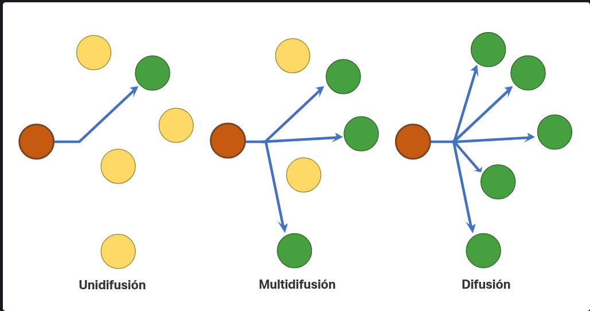

# [*] Tema 3.2.1 : Descripción General del Protocolo de Red.

Usted sabe que para que los dispositivos finales puedan comunicarse a través de una red, cada dispositivo debe cumplir el mismo conjunto de reglas. Estas reglas se denominan protocolos y tienen muchas funciones en una red. En este tema se ofrece una descripción general de los protocolos de red.

Los protocolos de red definen un formato y un conjunto de reglas comunes para intercambiar mensajes entre dispositivos. Los protocolos son implementados por dispositivos finales y dispositivos intermediarios en software, hardware o ambos. Cada protocolo de red tiene su propia función, formato y reglas para las comunicaciones.

En la tabla se enumeran los distintos tipos de protocolos que se necesitan para habilitar las comunicaciones en una o más redes.

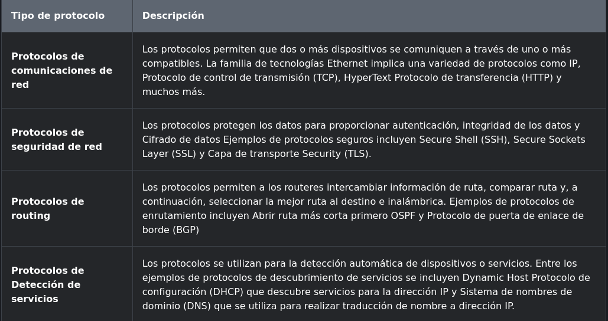

# [*] Tema 3.2.2 : Funciones de protocolo de Red.

Los protocolos de comunicación de red son responsables de una variedad de funciones necesarias para las comunicaciones de red entre dispositivos finales. Por ejemplo, en la figura, ¿cómo envía el equipo un mensaje, a través de varios dispositivos de red, al servidor?

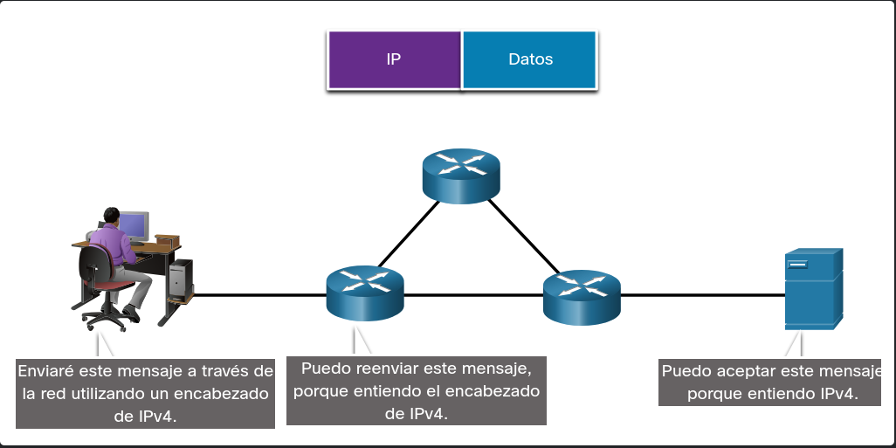

Los equipos y dispositivos de red utilizan protocolos acordados para comunicarse. La tabla enumera las funciones de estos protocolos.

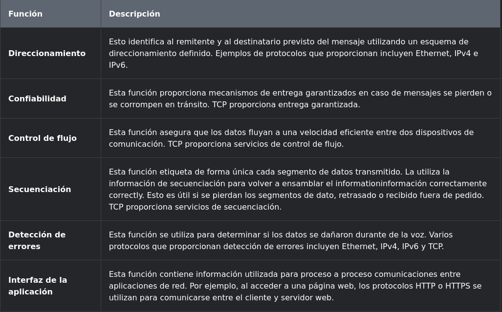

# [*] Tema 3.2.3 : Interacción de Protocolos.

Un mensaje enviado a través de una red informática normalmente requiere el uso de varios protocolos, cada uno con sus propias funciones y formato. La figura muestra algunos protocolos de red comunes que se utilizan cuando un dispositivo envía una solicitud a un servidor web para su página web.

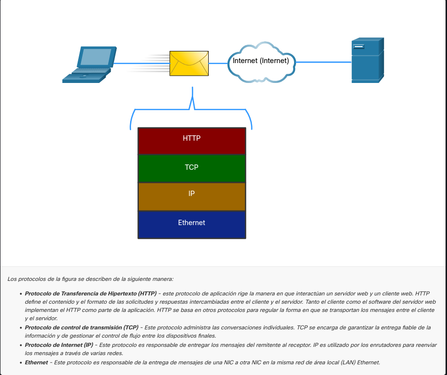

# [*] Tema 3.3.1 : Conjuntos de protocolos de red

En muchos casos, los protocolos deben poder trabajar con otros protocolos para que su experiencia en línea le proporcione todo lo que necesita para las comunicaciones de red. Los conjuntos de protocolos están diseñados para funcionar entre sí sin problemas.

Un grupo de protocolos interrelacionados que son necesarios para realizar una función de comunicación se denomina suite de protocolos.

Una de las mejores formas para visualizar el modo en que los protocolos interactúan dentro de una suite es ver la interacción como una pila. Una pila de protocolos muestra la forma en que los protocolos individuales se implementan dentro de una suite. Los protocolos se muestran en capas, donde cada servicio de nivel superior depende de la funcionalidad definida por los protocolos que se muestran en los niveles inferiores. Las capas inferiores de la pila se encargan del movimiento de datos por la red y proporcionan servicios a las capas superiores, las cuales se enfocan en el contenido del mensaje que se va a enviar.

Como se muestra en la figura, podemos utilizar capas para describir la actividad que tiene lugar en el ejemplo de comunicación cara a cara. En la capa inferior, la capa física, hay dos personas, cada una con una voz que puede pronunciar palabras en voz alta. En el medio está la capa de reglas que estipula los requisitos de comunicación incluyendo que se debe elegir un lenguaje común. En la parte superior está la capa de contenido y aquí es donde se habla realmente el contenido de la comunicación.

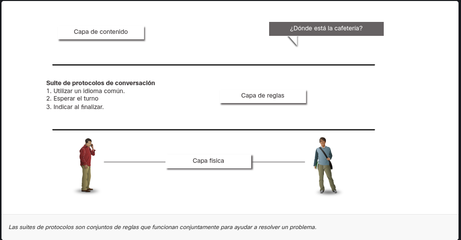

# [*] Tema 3.3.2 : Evolución de los conjuntos de protocolos

Una suite de protocolos es un grupo de protocolos que trabajan en forma conjunta para proporcionar servicios integrales de comunicación de red. Desde la década de 1970 ha habido varios conjuntos de protocolos diferentes, algunos desarrollados por una organización de estándares y otros desarrollados por varios proveedores.

Durante la evolución de las comunicaciones de red e Internet hubo varios conjuntos de protocolos competidores, como se muestra en la figura.


# [*] Tema 3.3.3 : Ejemplo de Protocolo TCP/IP

Los protocolos TCP/IP son específicos de las capas Aplicación, Transporte e Internet. No hay protocolos TCP/IP en la capa de acceso a la red. Los protocolos LAN de capa de acceso a la red más comunes son los protocolos Ethernet y WLAN (LAN inalámbrica). Los protocolos de la capa de acceso a la red son responsables de la entrega de los paquetes IP en los medios físicos.

La figura muestra un ejemplo de los tres protocolos TCP/IP utilizados para enviar paquetes entre el navegador web de un host y el servidor web. HTTP, TCP e IP son los protocolos TCP/IP utilizados. En la capa de acceso a la red, Ethernet se utiliza en el ejemplo. Sin embargo, esto también podría ser un estándar inalámbrico como WLAN o servicio celular.

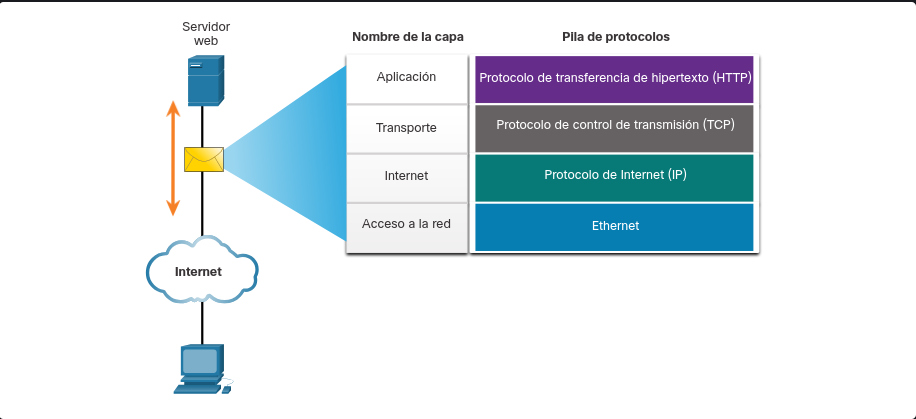


# [*] Tema 3.3.4 : Conjunto de TCP/IP

Hoy en día, el conjunto de protocolos TCP/IP incluye muchos protocolos y continúa evolucionando para admitir nuevos servicios. Algunos de los más populares se muestran en la figura.

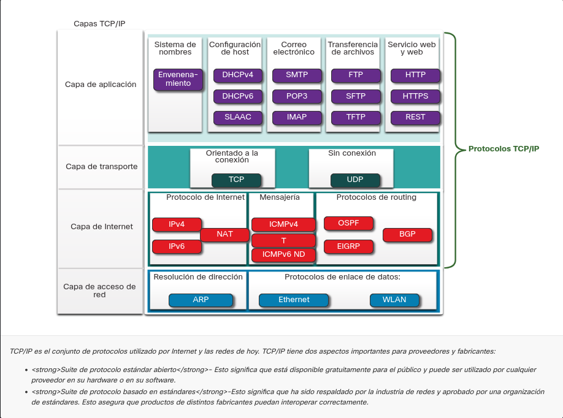

Capa de aplicación

Sistema de nombres

    DNS - Domain Name System. Traduce los nombres de dominio tales como cisco.com a direcciones IP

Configuración de host

    DHCPv4 - Protocolo de configuración dinámica de host para IPv4. Un servidor DHCPv4 asigna dinámicamente información de direccionamiento IPv4 a clientes DHCPv4 al inicio y permite que las direcciones se reutilicen cuando ya no sean necesarias.
    DHCPv6 - Protocolo de configuración dinámica de host para IPv6. DHCPv6 es similar a DHCPv4. Un servidor DHCPv6 asigna dinámicamente información de direccionamiento IPv6 a clientes DHCPv6 al inicio.
    SLAAC - Autoconfiguración sin estado. Método que permite a un dispositivo obtener su información de direccionamiento IPv6 sin utilizar un servidor DHCPv6.

Correo electrónico

    SMTP - Protocolo para Transferencia Simple de Correo. Les permite a los clientes enviar correo electrónico a un servidor de correo y les permite a los servidores enviar correo electrónico a otros servidores.
    POP3 -Protocolo de Oficinca de Correo versión 3. Permite a los clientes recuperar el correo electrónico de un servidor de correo y descargarlo en la aplicación de correo local del cliente.
    IMAP - Protocolo de Acceso a Mensajes de Internet Permite que los clientes accedan a correos electrónicos almacenados en un servidor de correo.

Transferencia de Archivos

    FTP - Protocolo de Transferencia de Archivos. Establece las reglas que permiten a un usuario en un host acceder y transferir archivos hacia y desde otro host a través de una red. FTP Es un protocolo confiable de entrega de archivos, orientado a la conexión y con acuse de recibo.
    SFTP - SSH Protocolo de Transferencia de Archivos Como una extensión al protocolo Shell seguro (SSH), el SFTP se puede utilizar para establecer una sesión segura de transferencia de archivos, en el que el archivo transferido está cifrado. SSH es un método para el inicio de sesión remoto seguro que se utiliza normalmente para acceder a la línea de comandos de un dispositivo.
    TFTP - Protocolo de Transferencia de Archivos Trivial Un protocolo de transferencia de archivos simple y sin conexión con la entrega de archivos sin reconocimiento y el mejor esfuerzo posible. Utiliza menos sobrecarga que FTP.

Web y Servicio Web

    HTTP - Hypertext Transfer Protocol. Un Conjunto de reglas para intercambiar texto, imágenes gráficas, sonido, video y otros archivos multimedia en la World Wide Web.
    HTTPS - HTTP seguro. Una forma segura de HTTP que cifra los datos que se intercambian a través de la World Wide Web.
    REST - Transferencia de Estado Representacional. Servicio web que utiliza interfaces de programación de aplicaciones (API) y solicitudes HTTP para crear aplicaciones web.


Capa de transporte

Orientado a la conexión

    TCP - Protocolo de Control de Transmisión. Permite la comunicación confiable entre procesos que se ejecutan en hosts independientes y tiene transmisiones fiables y con acuse de recibo que confirman la entrega exitosa.

Sin conexión

    UDP - Protocolo de Datagramas de Usuario Habilita un proceso que se ejecuta en un host para enviar paquetes a un proceso que se ejecuta en otro host Sin embargo, UDP No confirma la transmisión correcta de datagramas


Capa de Internet

Protocolo de Internet

    IPv4 - Protocolo de Internet versión 4. Recibe segmentos de mensajes de la capa de transporte, empaqueta mensajes en paquetes y dirige paquetes para entrega end-to-end a través de una red. IPv4 utiliza una dirección de 32 bits.
    IPv6 - IP versión 6. Similar a IPv4 pero usa una dirección de 128 bits.
    NAT - Traducción de Direcciones de Red Traduce las direcciones IPv4 de una red privada en direcciones IPv4 públicas globalmente únicas.

Mensajería

    ICMPv4 - Protocolo de Control de Mensajes de Internet Proporciona comentarios desde un host de destino a un host de origen con respecto a los errores en la entrega de paquetes
    ICMPv6 - ICMP para IPv6. Funcionalidad similar a ICMPv4 pero se utiliza para paquetes IPv6.
    ICMPv6 ND - Protocolo de Descubrimiento de Vecinos versión 6 Incluye cuatro mensajes de protocolo que se utilizan para la resolución de direcciones y la detección de direcciones duplicadas.

Protocolos de Routing

    OSPF - Abrir el Camino más Corto Primero. Protocolo de enrutamiento de estado de vínculo que utiliza un diseño jerárquico basado en áreas. OSPF s un protocolo de routing interior de estándar abierto.
    EIGRP - EIGRP Protocolo de Enrutamiento de Puerta de enlace Interior Mejorado. Es un protocolo de routing abierto desarrollado por Cisco, utiliza una métrica compuesta en función del ancho de banda, la demora, la carga y la confiabilidad.
    BGP - Protocolo de Puerta de Enlace de Frontera Un protocolo de enrutamiento de puerta de enlace exterior estándar abierto utilizado entre los proveedores de servicios de Internet (ISP). BGP también se utiliza entre los ISP y sus clientes privados más grandes para intercambiar información de enrutamiento.


Capa de Acceso de Red

Resolución de dirección

    ARP - Protocolo de Resolución de Direcciones Proporciona la asignación de direcciones dinámicas entre una dirección IP y una dirección de hardware.

    Nota: Puede ver otro estado de documentación que ARP opera en la capa de Internet (OSI Capa 3). Sin embargo, en este curso declaramos que ARP opera en la capa de acceso a la red (OSI Capa 2) porque su objetivo principal es descubrir la dirección MAC del destino. y una dirección de capa 2 es una dirección MAC.

Protocolos de Enlace de Datos:

    Ethernet - define las reglas para conectar y señalizar estándares de la capa de acceso a la red.
    WLAN - Wireless Local Area Network. Define las reglas para la señalización inalámbrica a través de las frecuencias de radio de 2,4 GHz y 5 GHz.


# [*] Tema 3.3.5 : Proceso de Comunicación de TCP/IP


La animación en las figuras demuestra el proceso de comunicación completo mediante un ejemplo de servidor web que transmite datos a un cliente.

En la figura, haga clic en Reproducir para ver el proceso de encapsulamiento cuando un servidor web envía una página web a un cliente web.

# [*] Tema 3.4.1 : Estandares Abiertos

Al comprar neumáticos nuevos para un automóvil, hay muchos fabricantes que puede elegir. Cada uno de ellos tendrá al menos un tipo de neumático que se adapte a su coche. Esto se debe a que la industria automotriz utiliza estándares cuando se producen automóviles. Es lo mismo con los protocolos. Debido a que hay muchos fabricantes diferentes de componentes de red, todos deben usar los mismos estándares. En el establecimiento de redes, las normas son elaboradas por organizaciones internacionales de normalización.

Los estándares abiertos fomentan la interoperabilidad, la competencia y la innovación. También garantizan que ningún producto de una sola empresa pueda monopolizar el mercado o tener una ventaja desleal sobre la competencia.

La compra de un router inalámbrico para el hogar constituye un buen ejemplo de esto. Existen muchas opciones distintas disponibles de diversos proveedores, y todas ellas incorporan protocolos estándares, como IPv4, DHCP, 802.3 (Ethernet) y 802.11 (LAN inalámbrica). Estos estándares abiertos también permiten que un cliente con el sistema operativo OS X de Apple descargue una página web de un servidor web con el sistema operativo Linux. Esto se debe a que ambos sistemas operativos implementan los protocolos de estándar abierto, como los de la suite TCP/IP.

Las organizaciones de estandarización generalmente son organizaciones sin fines de lucro y neutrales en lo que respecta a proveedores, que se establecen para desarrollar y promover el concepto de estándares abiertos. Las organizaciones de estandarización son importantes para mantener una Internet abierta con especificaciones y protocolos de libre acceso que pueda implementar cualquier proveedor.

Las organizaciones de estandarización pueden elaborar un conjunto de reglas en forma totalmente independiente o, en otros casos, pueden seleccionar un protocolo exclusivo como base para el estándar. Si se utiliza un protocolo exclusivo, suele participar el proveedor que creó el protocolo.

La figura muestra el logotipo de cada organización de normas.

# [*] Tema 3.4.2 : Estandares de Internet

Distintas organizaciones tienen diferentes responsabilidades para promover y elaborar estándares para el protocolo TCP/IP.

La figura muestra las organizaciones de estándares involucradas con el desarrollo y soporte de Internet.

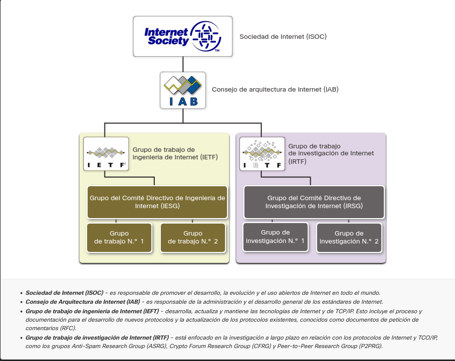

La siguiente figura muestra las organizaciones de estándares involucradas en el desarrollo y soporte de TCP/IP e incluyen IANA e ICANN.

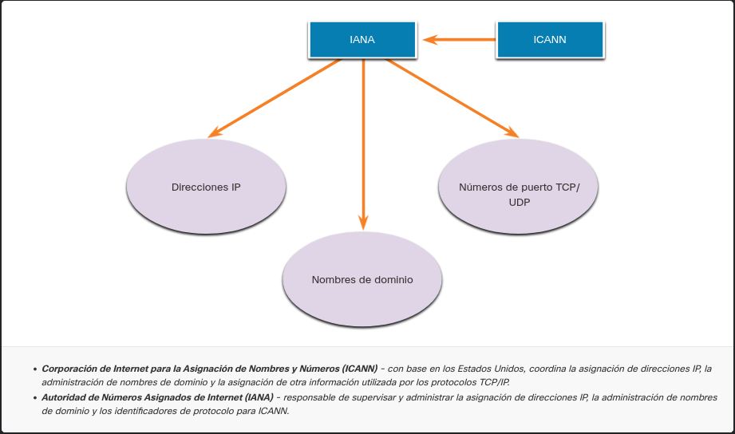

# [*] Tema 3.4.3 : Organizaciones de estándares para comunicaciones y electrónica

Otras organizaciones de estandarización tienen responsabilidades de promoción y creación de estándares de comunicación y electrónica que se utilizan en la entrega de paquetes IP como señales electrónicas en medios inalámbricos o por cable.

Estas organizaciones estándar incluyen las siguientes:

    Institute of Electrical and Electronics Engineers (IEEE, pronounced “I-triple-E”): organización de electrónica e ingeniería eléctrica dedicada a avanzar en innovación tecnológica y a elaborar estándares en una amplia gama de sectores, que incluyen energía, servicios de salud, telecomunicaciones y redes. Los estándares importantes de red IEEE incluyen 802.3 Ethernet y 802.11 WLAN. Busque en Internet otros estándares de red IEEE.
    Asociación de Industrias Electrónicas (EIA): es conocida principalmente por sus estándares relacionados con el cableado eléctrico, los conectores y los racks de 19 in que se utilizan para montar equipos de red.
    Asociación de las Industrias de las Telecomunicaciones (TIA): es responsable de desarrollar estándares de comunicación en diversas áreas, entre las que se incluyen equipos de radio, torres de telefonía móvil, dispositivos de voz sobre IP (VoIP), comunicaciones satelitales y más. La figura muestra un ejemplo de un cable Ethernet certificado que fue desarrollado cooperativamente por la TIA y la EIA.
    Sector de Normalización de las Telecomunicaciones de la Unión Internacional de Telecomunicaciones (UIT-T): es uno de los organismos de estandarización de comunicación más grandes y más antiguos. El UIT-T define estándares para la compresión de vídeos, televisión de protocolo de Internet (IPTV) y comunicaciones de banda ancha, como la línea de suscriptor digital (DSL).


# [*] Tema 3.5.1 : Beneficios del uso de un modelo en capas

En realidad no se puede ver que los paquetes reales viajan a través de una red real, la forma en que se pueden ver los componentes de un coche que se ensamblan en una línea de ensamble. Por lo tanto, ayuda tener una forma de pensar acerca de una red para que usted pueda imaginar lo que está sucediendo. Un modelo es útil en estas situaciones.

Conceptos complejos, como el funcionamiento de una red, pueden ser difíciles de explicar y comprender. Por esta razón, un modelo en capas se utiliza para modularizar las operaciones de una red en capas manejables.

Los beneficios por el uso de un modelo en capas para describir protocolos de red y operaciones incluyen lo siguiente:.

Ayuda en el diseño de protocolos, ya que los protocolos que operan en una capa específica tienen información definida según la cual actúan, y una interfaz definida para las capas superiores e inferiores.

Fomenta la competencia, ya que los productos de distintos proveedores pueden trabajar en conjunto.

Evita que los cambios en la tecnología o en las funcionalidades de una capa afecten otras capas superiores e inferiores.

Proporciona un lenguaje común para describir las funciones y capacidades de red.

Como se muestra en la figura, hay dos modelos en capas que se utilizan para describir las operaciones de red:

Modelo de referencia de interconexión de sistemas abiertos.

Modelo de referencia TCP/IP

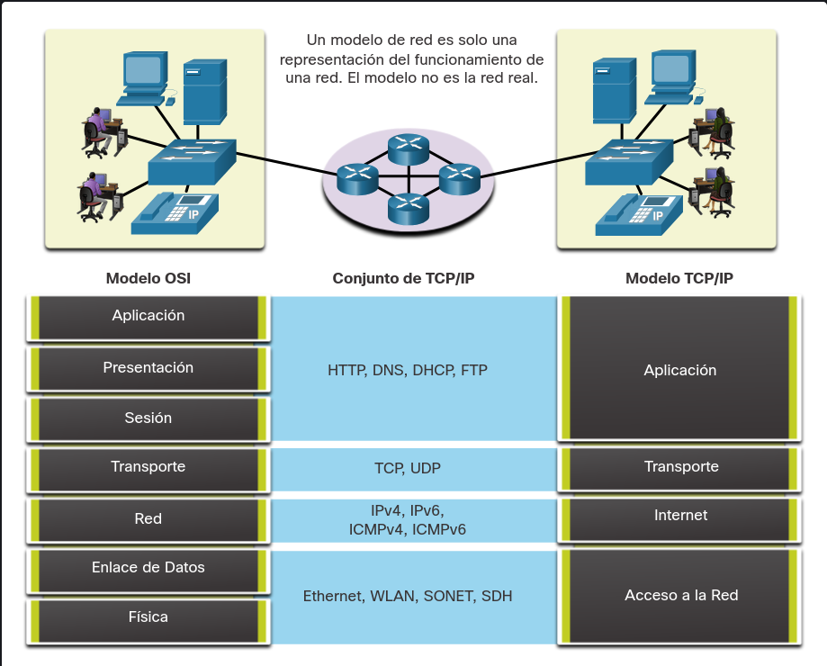

# [*] Tema 3.5.2 : El modelo de referencia OSI

El modelo de referencia OSI proporciona una amplia lista de funciones y servicios que se pueden presentar en cada capa. este tipo de modelo es coherente con todos los tipos de servicios y protocolos de red al describir qué es lo que se debe hacer en una capa determinada, pero sin regir la forma en que se debe lograr.

También describe la interacción de cada capa con las capas directamente por encima y por debajo de él. Los protocolos TCP/IP que se analizan en este curso se estructuran en torno a los modelos OSI y TCP/IP. La tabla muestra detalles sobre cada capa del modelo OSI. La funcionalidad de cada capa y la relación entre ellas será más evidente a medida que avance en el curso y que se brinden más detalles acerca de los protocolos.

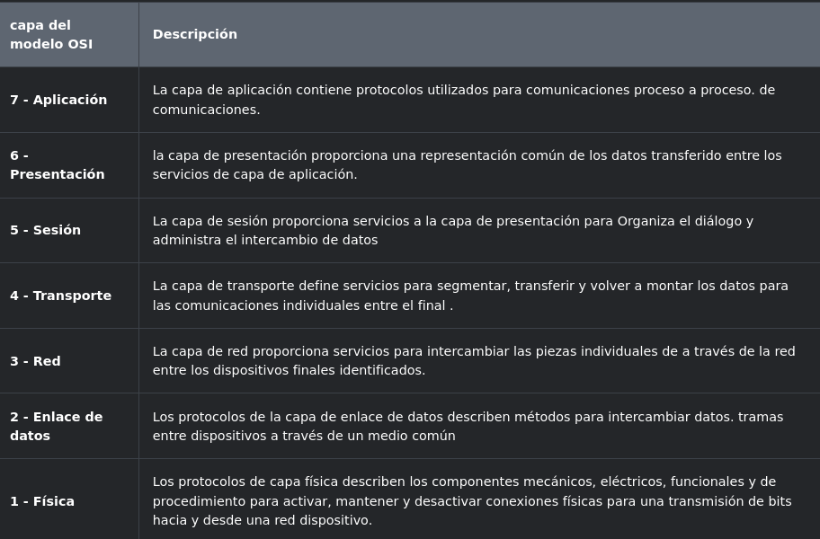

Nota: mientras las capas del modelo TCP/IP se mencionan solo por el nombre, las siete capas del modelo OSI se mencionan con frecuencia por número y no por nombre. Por ejemplo, la capa física se conoce como Capa 1 del modelo OSI, la capa de enlace de datos es Layer2, y así sucesivamente.

# [*] Tema 3.5.3 : Modelo de Protocolo TCP/IP

El modelo de protocolo TCP/IP para comunicaciones de internetwork se creó a principios de la década de los setenta y se conoce con el nombre de modelo de Internet. Este tipo de modelo coincide con precisión con la estructura de una suite de protocolos determinada. El modelo TCP/IP es un protocolo modelo porque describe las funciones que ocurren en cada capa de protocolos dentro de una suite de TCP/IP. TCP/IP también es un ejemplo de un modelo de referencia. La tabla muestra detalles sobre cada capa del modelo OSI.

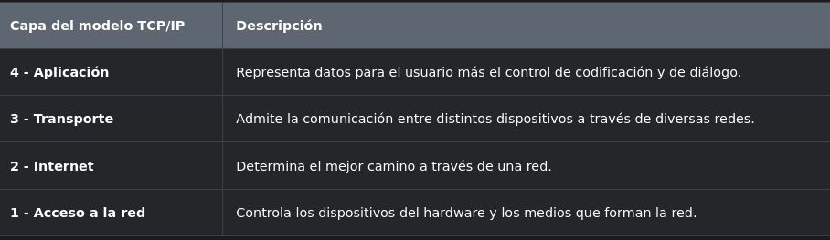

Las definiciones del estándar y los protocolos TCP/IP se explican en un foro público y se definen en un conjunto de documentos de petición de comentarios (RFC) disponibles al público. Un RFC es creado por ingenieros de redes y enviado a otros miembros de IETF para comentarios.

# [*] Tema 3.5.4 : Comparación del modelo OSI y el modelo TCP/IP

Los protocolos que forman la suite de protocolos TCP/IP pueden describirse en términos del modelo de referencia OSI. En el modelo OSI, la capa de acceso a la red y la capa de aplicación del modelo TCP/IP están subdivididas para describir funciones discretas que deben producirse en estas capas.

En la capa de acceso a la red, la suite de protocolos TCP/IP no especifica cuáles protocolos utilizar cuando se transmite por un medio físico; solo describe la transferencia desde la capa de Internet a los protocolos de red física. Las capas OSI 1 y 2 tratan los procedimientos necesarios para acceder a los medios y las maneras físicas de enviar datos por la red.


# [*] Tema 3.6.1 : Segmentacion del Mensaje

Conocer el modelo de referencia OSI y el modelo de protocolo TCP/IP será útil cuando aprenda acerca de cómo se encapsulan los datos a medida que se mueven a través de una red. No es tan simple como una carta física que se envía a través del sistema de correo.

En teoría, una comunicación simple, como un vídeo musical o un correo electrónico puede enviarse a través de la red desde un origen hacia un destino como una transmisión de bits masiva y continua. Sin embargo, esto crearía problemas para otros dispositivos que necesitan utilizar los mismos canales de comunicación o enlaces. Estas grandes transmisiones de datos originarán retrasos importantes. Además, si falla un enlace en la infraestructura de la red interconectada durante la transmisión, el mensaje completo se perdería y tendría que retransmitirse completamente.

Un método mejor es dividir los datos en partes más pequeñas y manejables para enviarlas por la red. La segmentación es el proceso de dividir un flujo de datos en unidades más pequeñas para transmisiones a través de la red. La segmentación es necesaria porque las redes de datos utilizan el conjunto de protocolos TCP/IP para enviar datos en paquetes IP individuales. Cada paquete se envía por separado, similar al envío de una carta larga como una serie de postales individuales. Los paquetes que contienen segmentos para el mismo destino se pueden enviar a través de diferentes rutas.

La segmentación de mensajes tiene dos beneficios principales.

    Aumenta la velocidad - Debido a que un flujo de datos grande se segmenta en paquetes, se pueden enviar grandes cantidades de datos a través de la red sin atar un enlace de comunicaciones. Esto permite que muchas conversaciones diferentes se intercalen en la red llamada multiplexación.
    Aumenta la eficiencia - si un solo segmento no llega a su destino debido a una falla en la red o congestión de la red, solo ese segmento necesita ser retransmitido en lugar de volver a enviar toda la secuencia de datos.

Haga clic en cada botón de la figura 1 y, a continuación, haga clic en el botón Reproducir para ver las animaciones de segmentación y de multiplexión.

# [*] Tema 3.6.2 : Secuenciacion

La desventaja de utilizar segmentación y multiplexión para transmitir mensajes a través de la red es el nivel de complejidad que se agrega al proceso. Supongamos que tuviera que enviar una carta de 100 páginas, pero en cada sobre solo cabe una. Por lo tanto, se necesitarían 100 sobres y cada sobre tendría que dirigirse individualmente. Es posible que la carta de 100 páginas en 100 sobres diferentes llegue fuera de pedido. En consecuencia, la información contenida en el sobre tendría que incluir un número de secuencia para garantizar que el receptor pudiera volver a ensamblar las páginas en el orden adecuado.

En las comunicaciones de red, cada segmento del mensaje debe seguir un proceso similar para asegurar que llegue al destino correcto y que puede volverse a ensamblar en el contenido del mensaje original, como se muestra en la figura 2. TCP es responsable de secuenciar los segmentos individuales.

# [*] Tema 3.6.3 : Unidades de datos de protocolo

Mientras los datos de la aplicación bajan a la pila del protocolo y se transmiten por los medios de la red, se agrega diversa información de protocolos en cada nivel. Esto comúnmente se conoce como proceso de encapsulamiento.

Nota: Aunque la PDU UDP se denomina datagrama, los paquetes IP a veces también se conocen como datagramas IP.

La manera que adopta una porción de datos en cualquier capa se denomina unidad de datos del protocolo (PDU). Durante el encapsulamiento, cada capa encapsula las PDU que recibe de la capa inferior de acuerdo con el protocolo que se utiliza. En cada etapa del proceso, una PDU tiene un nombre distinto para reflejar sus funciones nuevas. Aunque no existe una convención universal de nombres para las PDU, en este curso se denominan de acuerdo con los protocolos de la suite TCP/IP. Las PDU de cada tipo de datos se muestran en la figura.

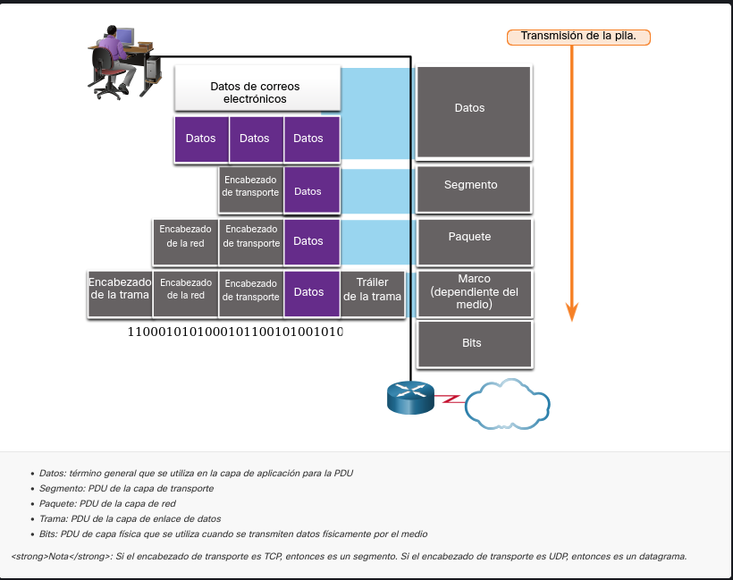

# [*] Tema 3.6.4 : Ejemplo de encapsulamiento

Cuando se envían mensajes en una red, el proceso de encapsulamiento opera desde las capas superiores hacia las capas inferiores. En cada capa, la información de la capa superior se considera como datos en el protocolo encapsulado. Por ejemplo, el segmento TCP se considera como datos en el paquete IP.

Usted vio esta animación anteriormente en este módulo. Esta vez, haga clic en Reproducir y concéntrese en el proceso de encapsulación ya que un servidor web envía una página web a un cliente web.

# [*] Tema 3.6.5 : Ejemplo de desencapsulamiento

Este proceso se invierte en el host receptor, y se conoce como desencapsulamiento. El desencapsulamiento es el proceso que utilizan los dispositivos receptores para eliminar uno o más de los encabezados de protocolo. Los datos se desencapsulan mientras suben por la pila hacia la aplicación del usuario final.

Usted vio esta animación anteriormente en este módulo. Esta vez, haga clic en Reproducir y concéntrese en el proceso de desencapsulación.

# [*] Tema 3.7.1 : Direcciones

Como acaba de aprender, es necesario segmentar los mensajes en una red. Pero esos mensajes segmentados no irán a ninguna parte si no se abordan correctamente. En este tema se ofrece una descripción general de las direcciones de red. También tendrá la oportunidad de usar la herramienta Wireshark, que le ayudará a 'ver' el tráfico de la red.

La capa de red y la capa de enlace de datos son responsables de enviar los datos desde el dispositivo de origen o emisor hasta el dispositivo de destino o receptor. Como se muestra en la figura 1, los protocolos de las dos capas contienen las direcciones de origen y de destino, pero sus direcciones tienen objetivos distintos.

    Direcciones de origen y de destino de la capa de red: son responsables de enviar el paquete IP desde el dispositivo de origen hasta el dispositivo final, ya sea en la misma red o a una red remota.
    Direcciones de origen y de destino de la capa de enlace de datos: son responsables de enviar la trama de enlace de datos desde una tarjeta de interfaz de red (NIC) a otra en la misma red.


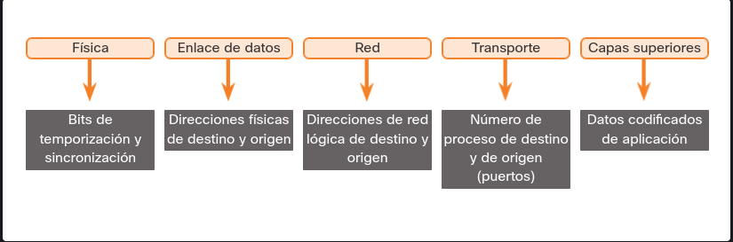

# [*] Tema 3.7.2 : Direccion de Logica de Capa 3

Una dirección lógica de la capa de red, o capa 3, se utiliza para enviar el paquete IP desde el dispositivo de origen hasta el dispositivo de destino, como se muestra en la figura.

Los paquetes IP contienen dos direcciones IP:

    Dirección IP de origen: la dirección IP del dispositivo emisor, la fuente de origen del paquete..
    Dirección IP de destino: la dirección IP del dispositivo receptor, es decir, el destino final del paquete..

Las direcciones de la capa de red, o direcciones IP, indican el origen y el destino final. Esto es cierto si el origen y el destino están en la misma red IP o redes IP diferentes.

Un paquete IP contiene dos partes:

    Porción de red (IPv4) o Prefijo (IPv6): la sección más a la izquierda de la dirección que indica la red de la que es miembro la dirección IP. Todos los dispositivos de la misma red tienen la misma porción de red de la dirección.
    Porción de host (IPv4) o ID de interfaz (IPv6): la parte restante de la dirección que identifica un dispositivo específico de la red. La sección de host es única para cada dispositivo o interfaz en la red.

Nota: La máscara de subred (IPv4) o la longitud del prefijo (IPv6) se utiliza para identifica la porción de red de una dirección IP de la porción del host.


# [*] Tema 3.7.3 : Dispositivos en la Misma Red.

En este ejemplo, tenemos un equipo cliente, PC1, que se comunica con un servidor FTP, en la misma red IP.

    Dirección IPv4 de origen: - la dirección IPv4 del dispositivo emisor, es decir, el equipo cliente PC1: 192.168.1.110.
    Dirección IPv4 de destino: - la dirección IPv4 del dispositivo receptor, el servidor FTP: 192.168.1.9.

En la figura, observe que la porción de red de las direcciones IP de origen y de destino se encuentran en la misma red. Observe en la figura que la parte de red de la dirección IPv4 de origen y la parte de red de la dirección IPv4 de destino son iguales y, por tanto, el origen y el destino están en la misma red.

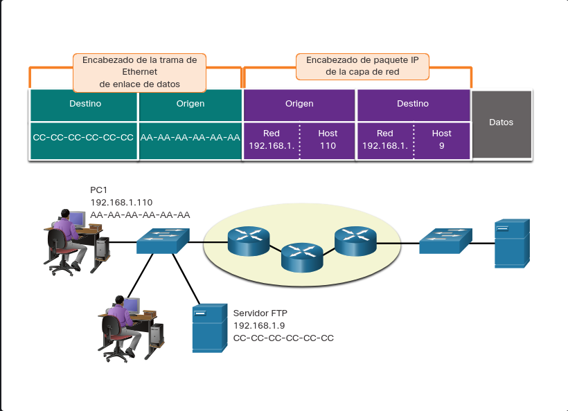

# [*] Tema 3.7.4 : Función de las direcciones de la capa de enlace de datos - La misma red IP

Cuando el emisor y el receptor del paquete IP están en la misma red, la trama de enlace de datos se envía directamente al dispositivo receptor. En una red Ethernet, las direcciones de enlace de datos se conocen como direcciones de Control de acceso a medios de Ethernet (MAC), como se resalta en la figura.

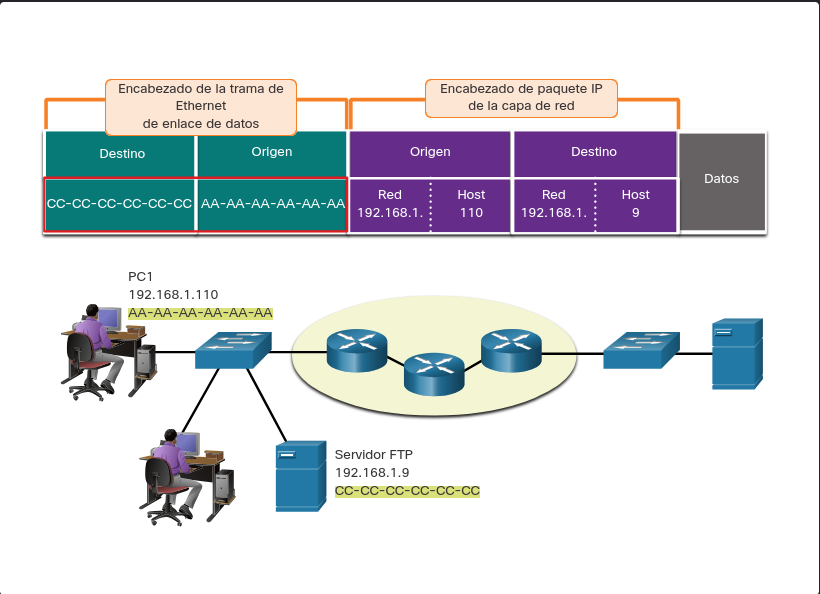

Las direcciones MAC están integradas físicamente a la NIC Ethernet.

    Dirección MAC de origen: la dirección de enlace de datos, o la dirección MAC de Ethernet, del dispositivo que envía la trama de enlace de datos con el paquete IP encapsulado. La dirección MAC de la NIC Ethernet de PC1 es AA-AA-AA-AA-AA-AA, redactada en notación hexadecimal.
    Dirección MAC de destino: cuando el dispositivo receptor está en la misma red que el dispositivo emisor, la dirección MAC de destino es la dirección de enlace de datos del dispositivo receptor. En este ejemplo, la dirección MAC de destino es la dirección MAC del servidor FTP: CC-CC-CC-CC-CC-CC, escrito en notación hexadecimal.

La trama con el paquete IP encapsulado ahora se puede transmitir desde PC1 directamente hasta el servidor FTP.

# [*] Tema 3.7.6 : Función de las direcciones de la capa de red

Cuando el emisor del paquete se encuentra en una red distinta de la del receptor, las direcciones IP de origen y de destino representan los hosts en redes diferentes. Esto lo indica la porción de red de la dirección IP del host de destino.

    Dirección IPv4 de origen: - la dirección IPv4 del dispositivo emisor, es decir, el equipo cliente PC1: 192.168.1.110.
    Dirección IPv4 de destino: - la dirección IPv4 del dispositivo receptor, es decir, el servidor web: 172.16.1.99.

En la figura, observe que la porción de red de las direcciones IP de origen y de destino se encuentran en redes diferentes.

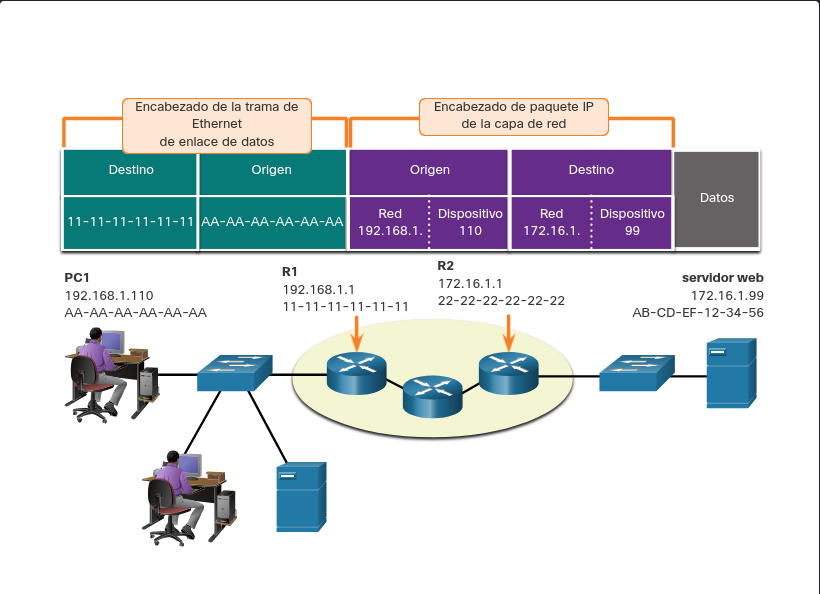

# [*] Tema 3.7.7 : Rol de acceso a datos de las direcciones de capa de vínculo de datos - Diferentes redes IP

Cuando el emisor y el receptor del paquete IP se encuentran en redes diferentes, la trama de enlace de datos de Ethernet no se puede enviar directamente al host de destino, debido a que en la red del emisor no se puede tener acceso directamente al host. La trama de Ethernet se debe enviar a otro dispositivo conocido como router o gateway predeterminado. En nuestro ejemplo, el gateway predeterminado es R1. R1 tiene una dirección de enlace de datos de Ethernet que se encuentra en la misma red que PC1. Esto permite que PC1 alcance el router directamente.

    Dirección MAC de origen: la dirección MAC de Ethernet del dispositivo emisor, PC1. La dirección MAC de la interfaz Ethernet de PC1 es AA-AA-AA-AA-AA-AA.
    Dirección MAC de destino: cuando el dispositivo receptor, la dirección IP de destino, está en una red distinta de la del dispositivo emisor, este utiliza la dirección MAC de Ethernet del gateway predeterminado o el router. En este ejemplo, la dirección MAC de destino es la dirección MAC de la interfaz Ethernet de R1, 11-11-11-11-11-11. Esta es la interfaz que está conectada a la misma red que PC1, como se muestra en la figura.


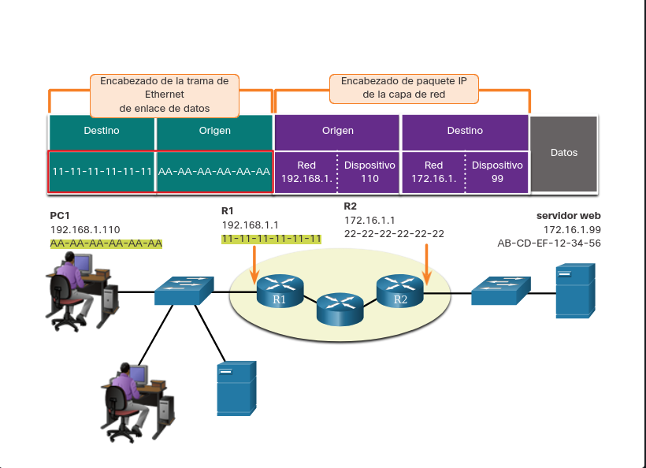

La trama de Ethernet con el paquete IP encapsulado ahora se puede transmitir a R1. R1 reenvía el paquete al destino, el servidor web. Esto puede significar que R1 reenvía el paquete a otro router o directamente al servidor web si el destino se encuentra en una red conectada a R1.

Es importante que en la dirección IP del gateway predeterminado esté configurada en cada host de la red local. Todos los paquetes que tienen como destino redes remotas se envían al gateway predeterminado. Las direcciones MAC de Ethernet y el gateway predeterminado se analizan en capítulos más adelante.


# [*] Tema 3.7.8 : Direcciones de enlace de datos

La dirección física de la capa de enlace de datos, o capa 2, tiene una función distinta. Su propósito es enviar la trama de enlace de datos desde una interfaz de red hasta otra interfaz de red en la misma red.

Antes de que un paquete IP pueda enviarse a través de una red conectada por cable o inalámbrica, se debe encapsular en una trama de enlace de datos de modo que pueda transmitirse a través del medio físico.

A medida que el paquete IP se mueve de host a router, de router a router y, finalmente, de router a host, es encapsulado en una nueva trama de enlace de datos, en cada punto del recorrido. Cada trama de enlace de datos contiene la dirección de origen de enlace de datos de la tarjeta NIC que envía la trama y la dirección de destino de enlace de datos de la tarjeta NIC que recibe la trama.

El protocolo de enlace de datos de capa 2 solo se utiliza para enviar el paquete de NIC a NIC en la misma red. El router elimina la información de la capa 2 a medida que una NIC la recibe y agrega nueva información de enlace de datos antes de reenviarla a la NIC de salida en su recorrido hacia el dispositivo de destino final.

El paquete IP se encapsula en una trama de enlace de datos que contiene información de enlace de datos, como la siguiente:

    Dirección de enlace de datos de origen: la dirección física de la NIC del dispositivo que envía la trama de enlace de datos.
    Dirección de enlace de datos de destino: la dirección física de la NIC que recibe la trama de enlace de datos. Esta dirección es el router del salto siguiente o el dispositivo de destino final.

# [*] Tema 3.8.1 : ¿Qué aprenderé en este módulo?

Las reglas

Todos los métodos de comunicación tienen tres elementos en común: origen del mensaje (remitente), destino del mensaje (receptor) y canal. El envío de un mensaje se rige por reglas denominadas protocols. Los protocolos deben incluir: un remitente y receptor identificado, lenguaje y gramática comunes, velocidad y tiempo de entrega, y requisitos de confirmación o acuse de recibo. Los protocolos de red determinan la codificación, el formato, la encapsulación, el tamaño, la distribución y las opciones de entrega del mensaje. La codificación es el proceso mediante el cual la información se convierte en otra forma aceptable para la transmisión. La decodificación revierte este proceso para interpretar la idea. Los formatos de los mensajes dependen del tipo de mensaje y el canal que se utilice para entregar el mensaje. Sincronización: incluye el método de acceso, control del flujo y tiempo de espera de respuesta. Las opciones de entrega de mensajes incluyen unidifusión, multidifusión y difusión.

Protocolos

Los protocolos son implementados por dispositivos finales y dispositivos intermediarios en software, hardware o ambos. Un mensaje enviado a través de una red informática normalmente requiere el uso de varios protocolos, cada uno con sus propias funciones y formato. Cada protocolo de red tiene su propia función, formato y reglas para las comunicaciones. La familia de protocolos Ethernet incluye IP, TCP, HTTP y muchos más. Los protocolos protegen los datos para proporcionar autenticación, integridad de los datos y cifrado de datos: SSH, SSL y TLS. Los protocolos permiten a los routeres intercambiar información de ruta, comparar información de ruta y, a continuación, seleccionar la mejor ruta de acceso a la red de destino: OSPF y BGP. Los protocolos se utilizan para la detección automática de dispositivos o servicios: DHCP y DNS. Los equipos y dispositivos de red utilizan protocolos acordados que proporcionan las siguientes funciones: direccionamiento, confiabilidad, control de flujo, secuenciación, detección de errores e interfaz de aplicación.

Suite de Protocolos

Un grupo de protocolos interrelacionados que son necesarios para realizar una función de comunicación se denomina suite de protocolos. Una pila de protocolos muestra la forma en que los protocolos individuales se implementan dentro de una suite. Desde la década de 1970 ha habido varios conjuntos de protocolos diferentes, algunos desarrollados por una organización de estándares y otros desarrollados por varios proveedores. Los protocolos TCP/IP son específicos de las capas Aplicación, Transporte e Internet. TCP/IP es el conjunto de protocolos utilizado por las redes e Internet actuales. TCP/IP ofrece dos aspectos importantes a proveedores y fabricantes: conjunto de protocolos estándar abierto y conjunto de protocolos basado en estándares. El proceso de comunicación del conjunto de protocolos TCP/IP permite procesos tales como un servidor web encapsular y enviar una página web a un cliente, así como el cliente desencapsular la página web para mostrarla en un explorador web.

Organizaciones de estandarización

Los estándares abiertos fomentan la interoperabilidad, la competencia y la innovación. Las organizaciones de estandarización generalmente son organizaciones sin fines de lucro y neutrales en lo que respecta a proveedores, que se establecen para desarrollar y promover el concepto de estándares abiertos. Varias organizaciones tienen diferentes responsabilidades para promover y crear estándares para Internet, incluyendo: ISOC, IAB, IETF e IRTF. Las organizaciones de estándares que desarrollan y soportan TCP/IP incluyen: ICANN e IANA. Las organizaciones de estándares electrónicos y de comunicaciones incluyen: IEEE, EIA, TIA y ITU-T.

Modelos de referencia

Los dos modelos de referencia que se utilizan para describir las operaciones de red son OSI y TCP/IP. El modelo de referencia OSI tiene siete capas:

7 - Aplicación

6 - Presentación

5 - Sesión

4 - Transporte

3 - Red

2 - Enlacede datos

1 - Física

El modelo TCP/IP incluye cuatro capas.

4 - Aplicación

3 - Transporte

2 - Internet

1 - Acceso ala red

Encapsulación de datos

La segmentación de mensajes tiene dos beneficios principales.

    Al enviar partes individuales más pequeñas del origen al destino, se pueden intercalar muchas conversaciones diferentes en la red. Este proceso se denomina multiplexación.
    La segmentación puede aumentar la eficiencia de las comunicaciones de red. Si parte del mensaje no logra llegar al destino, solo deben retransmitirse las partes faltantes.

TCP es responsable de secuenciar los segmentos individuales. La manera que adopta una porción de datos en cualquier capa se denomina unidad de datos del protocolo (PDU). Durante el encapsulamiento, cada capa encapsula las PDU que recibe de la capa inferior de acuerdo con el protocolo que se utiliza. Cuando se envían mensajes en una red, el proceso de encapsulamiento opera desde las capas superiores hacia las capas inferiores. Este proceso se invierte en el host receptor, y se conoce como desencapsulamiento. El desencapsulamiento es el proceso que utilizan los dispositivos receptores para eliminar uno o más de los encabezados de protocolo. Los datos se desencapsulan mientras suben por la pila hacia la aplicación del usuario final.

Acceso a los datos

La capa de red y la capa de enlace de datos son responsables de enviar los datos desde el dispositivo de origen o emisor hasta el dispositivo de destino o receptor. Los protocolos de las dos capas contienen las direcciones de origen y de destino, pero sus direcciones tienen objetivos distintos.

    Direcciones de origen y de destino de la capa de red: son responsables de enviar el paquete IP desde el dispositivo de origen hasta el dispositivo final, ya sea en la misma red o a una red remota.
    Direcciones de origen y de destino de la capa de enlace de datos: son responsables de enviar la trama de enlace de datos desde una tarjeta de interfaz de red (NIC) a otra en la misma red.

Las direcciones de la capa de red, o direcciones IP, indican el origen y el destino final. Una dirección IP contiene dos partes: la parte de red (IPv4) o Prefijo (IPv6) y la parte de host (IPv4) o el ID de interfaz (IPv6). Cuando el emisor y el receptor del paquete IP están en la misma red, la trama de enlace de datos se envía directamente al dispositivo receptor. En una red Ethernet, las direcciones de enlace de datos se conocen como direcciones MAC de Ethernet. Cuando el emisor del paquete se encuentra en una red distinta de la del receptor, las direcciones IP de origen y de destino representan los hosts en redes diferentes. La trama de Ethernet se debe enviar a otro dispositivo conocido como router o gateway predeterminado.
